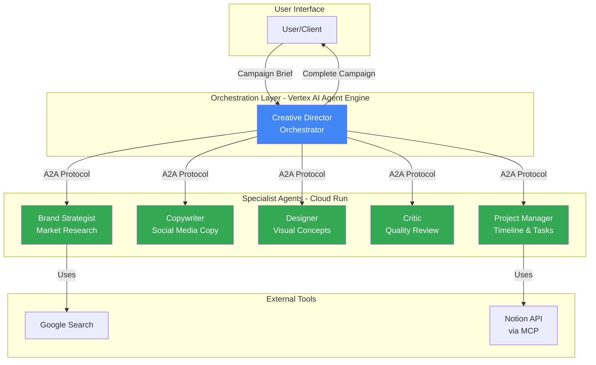
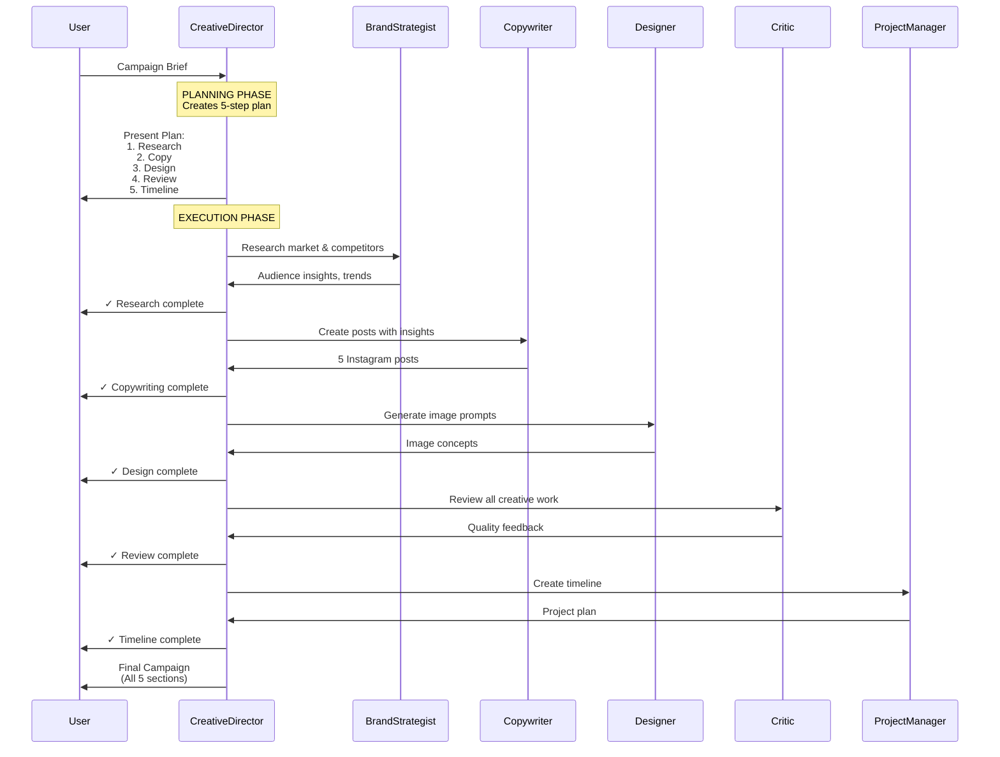
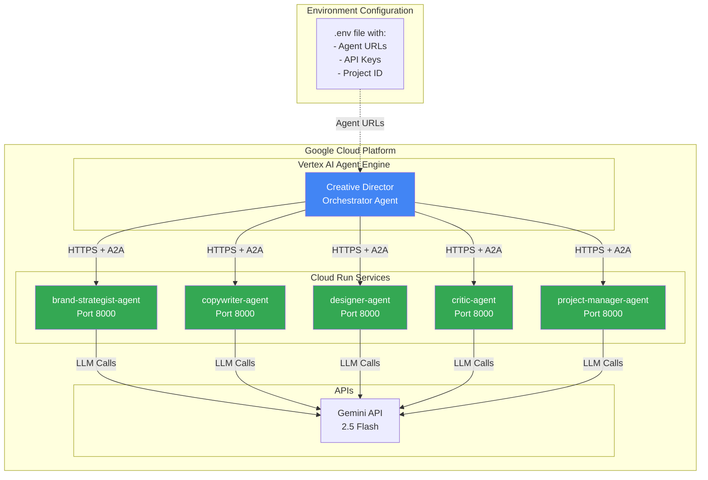
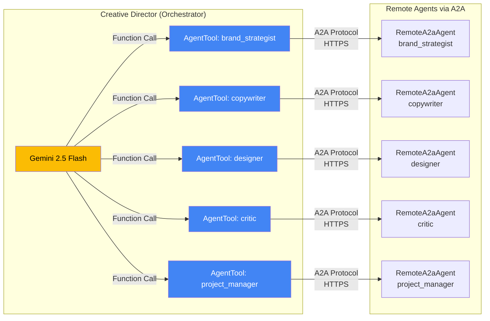
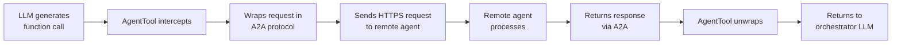

# AI Creative Studio

> A distributed multi-agent orchestration system using A2A protocol, Vertex AI Agent Engine, and Cloud Run - demonstrating agent-to-agent communication with remote specialist agents for social media campaign generation.

## 📋 Table of Contents

- [Overview](#overview)
- [Architecture](#architecture)
- [Agents Implementation](#agents-implementation)
- [Quick Start](#quick-start)
- [Deployment](#deployment)
- [Testing & Observability](#testing--observability)
- [Technology Stack](#technology-stack)
- [Troubleshooting](#troubleshooting)

---

## Overview

AI Creative Studio demonstrates **distributed multi-agent orchestration** for creating complete social media campaigns. It showcases the A2A protocol with an intelligent orchestrator (Creative Director) deployed on Vertex AI Agent Engine that coordinates 5 specialist agents running on Cloud Run to handle everything from market research to project planning with Notion integration.

### Key Features

- 🌐 **Distributed Multi-Agent System**: Orchestrator on Vertex AI Agent Engine coordinates 5 remote specialist agents on Cloud Run
- 🔄 **A2A Protocol**: Standardized agent-to-agent communication over HTTPS
- 🎯 **Intelligent Orchestration**: Flexible routing - calls 1 agent for simple tasks, all 5 for complete campaigns
- 📊 **Planning-First Approach**: Orchestrator creates execution plan before delegating
- 📝 **Notion MCP Integration**: Project Manager creates tasks directly in Notion via Model Context Protocol
- 🔍 **Built-in Observability**: Comprehensive logging and delegation tracking via plugins
- 🔧 **AgentTool Pattern**: Wraps remote agents as callable tools for flexible delegation

### What It Does

**Input**: Campaign brief
```
"Create Instagram campaign for EcoFlow smart water bottle targeting health-conscious millennials"
```

**Output**: Complete campaign with:
- Market research and competitor analysis
- 5 Instagram posts with captions and hashtags
- AI image generation prompts for each post
- Quality review and feedback
- Project timeline and deliverables
- Notion tasks created for project tracking (optional)

---

## Architecture

### System Architecture



### Agent Workflow (Complete Campaign)



### Deployment Architecture



### Agent Communication Flow



---

## Agents Implementation

### Agent Types

#### 1. Creative Director (Orchestrator)

**File**: `agents/creative_director/agent.py`

**Type**: `Agent` (not `LlmAgent`) with `AgentTool` wrappers

**Pattern**: AgentTool + Planning-First

**Key Implementation**:

```python
from google.adk.agents import Agent
from google.adk.agents.remote_a2a_agent import RemoteA2aAgent
from google.adk.tools.agent_tool import AgentTool

# Create remote agents
strategist_agent = RemoteA2aAgent(
    name="brand_strategist",
    description="Brand strategist for market research",
    agent_card=f"{STRATEGIST_URL}/.well-known/agent.json"
)

# Wrap as AgentTool
strategist_tool = AgentTool(agent=strategist_agent)

# Create orchestrator with tools
orchestrator = Agent(
    name="creative_director",
    model="gemini-2.5-flash",
    tools=[strategist_tool, copywriter_tool, designer_tool, critic_tool, pm_tool],
    instruction=PLANNING_FIRST_INSTRUCTION
)
```

**Instruction Pattern**:

The orchestrator uses a **planning-first** instruction pattern:

1. **Understand Request Complexity**: Determine if task needs 1 agent or all 5
2. **Create Plan BEFORE Delegating**: Outline complete sequence to user
3. **Execute Sequentially**: Call each agent, wait for response, confirm, continue
4. **Pass Context**: Each agent receives relevant output from previous agents

**Simple Request** → Calls 1 agent:
```
User: "Just research the market for eco water bottles"
→ Creative Director calls brand_strategist only
```

**Complex Request** → Calls all 5 agents:
```
User: "Create complete campaign with posts and timeline"
→ Creative Director executes all 5 steps sequentially
```

**Deployment**: Vertex AI Agent Engine (handles agent URLs via environment variables at runtime)

---

#### 2. Brand Strategist

**File**: `agents/brand_strategist/agent.py`

**Type**: `LlmAgent`

**Tools**: `google_search`

**Responsibility**: Research market trends, competitors, and target audience insights

**Output Format**:
```markdown
**Audience Insights:**
[Key behaviors, preferences, pain points]

**Competitive Analysis:**
[2-3 competitors - strengths and weaknesses]

**Trending Topics:**
[3-5 relevant trends]

**Key Strategic Insights:**
[High-level themes and positioning]
```

**Deployment**: Cloud Run with A2A server

---

#### 3. Copywriter

**File**: `agents/copywriter/agent.py`

**Type**: `LlmAgent`

**Tools**: None (pure LLM)

**Responsibility**: Create engaging social media captions and copy

**Input**: Receives campaign brief + brand strategist insights from conversation history

**Output Format**:
```markdown
### 1. Caption Title: [Theme]
**Full Caption Text:**
[Caption with emojis]

**Hashtags:**
#tag1 #tag2 #tag3...

**Suggested CTA:**
[Call to action]
```

**Deployment**: Cloud Run with A2A server

---

#### 4. Designer

**File**: `agents/designer/agent.py`

**Type**: `LlmAgent`

**Tools**: None (pure LLM)

**Responsibility**: Generate AI image concepts and visual design prompts

**Input**: Receives copywriter's posts from conversation history

**Output Format**:
```markdown
**For Caption 1: [Theme]**
**Concept A: [Visual Theme]**
- Prompt: [Detailed Imagen prompt]
- Style: [minimalist, vibrant, cinematic]
- Colors: [Palette]
- Mood: [energetic, calm, inspiring]
```

**Deployment**: Cloud Run with A2A server

---

#### 5. Critic

**File**: `agents/critic/agent.py`

**Type**: `LlmAgent`

**Tools**: None (pure LLM)

**Responsibility**: Review creative work and provide quality feedback

**Input**: Receives all outputs (strategy, copy, visuals) from conversation history

**Output Format**:
```markdown
**Overall Assessment:**
[Quality score and summary]

**Strengths:**
[What works well]

**Areas for Improvement:**
[Specific suggestions]

**Platform Optimization:**
[Instagram-specific recommendations]
```

**Deployment**: Cloud Run with A2A server

---

#### 6. Project Manager

**File**: `agents/project_manager/agent.py`

**Type**: `LlmAgent`

**Tools**: Notion MCP (Model Context Protocol)

**Responsibility**: Create project timelines, tasks, and deliverables with Notion integration

**MCP Integration**:
- Connects to Notion API via MCP server
- Creates tasks directly in Notion database
- Available operations:
  - `API-post-page`: Create new pages/tasks
  - `API-patch-page`: Update existing pages
  - `API-post-search`: Search pages
  - `API-post-database-query`: Query database
  - `API-retrieve-a-database`: Get database details

**Notion Database Properties**:
- Task name (title)
- Status (Not started, In progress, Done)
- Priority (High, Medium, Low)
- Due date
- Description
- Assignee
- Task type
- Effort level

**Input**: Receives complete campaign details from conversation history

**Output Format**:
```markdown
**Project Timeline:**
[Gantt-style timeline]

**Key Milestones:**
[Major checkpoints]

**Tasks & Deliverables:**
[Detailed task list with Notion links]

**Team Responsibilities:**
[Who does what]
```

**Deployment**: Cloud Run with A2A server and Notion MCP integration

---

### Agent-to-Agent (A2A) Protocol

All specialist agents expose an A2A server for remote communication:

```python
# agents/[agent_name]/app.py
from google.adk.servers.a2a_server import A2aServer

a2a_server = A2aServer(agent=root_agent)
app = a2a_server.create_app()

if __name__ == "__main__":
    a2a_server.run(port=8000)
```

**A2A Features**:
- 📡 **Agent Card**: `/.well-known/agent.json` - describes agent capabilities
- 🔄 **Stateless**: Each request is independent
- 🌐 **HTTP-based**: Standard HTTPS communication
- 📝 **JSONRPC**: Structured message format

---

### AgentTool Pattern

The orchestrator uses the **AgentTool pattern** to wrap remote agents as callable tools:

**Why AgentTool?**
- ✅ Flexible routing (LLM decides which agents to call)
- ✅ Can call same agent multiple times (revisions)
- ✅ Passes context between sequential calls
- ✅ Works with remote A2A agents

**How It Works**:



---

## Quick Start

### Prerequisites

- **Google Cloud Project** with billing enabled
- **Python 3.11+**
- **Google API Key** from [AI Studio](https://aistudio.google.com/app/apikey)
- **gcloud CLI** installed and configured
- **Node.js and npm** (for Notion MCP server via npx)
- **Notion Account** (optional, for Project Manager integration)
  - Create a Notion integration at [Notion Developers](https://www.notion.so/my-integrations)
  - Create a database in Notion with the following properties:
    - Task name (Title)
    - Status (Status)
    - Priority (Select)
    - Due date (Date)
    - Description (Rich text)
    - Summary (Rich text)
    - Assignee (People)
    - Task type (Multi-select)
    - Effort level (Select)
  - Share the database with your integration
  - Copy the Integration Token and Database ID

### 1. Clone and Install

```bash
# Clone repository
git clone <your-repo-url>
cd ai-creative-studio

# Create virtual environment
python3 -m venv venv
source venv/bin/activate  # On Windows: venv\Scripts\activate

# Install dependencies
pip install -r requirements.txt
```

### 2. Configure Environment

```bash
# Copy environment template
cp .env.example .env
```

Edit `.env` with your credentials:

```bash
# Google Cloud
PROJECT_ID="your-gcp-project-id"
REGION="us-central1"

# Gemini API
GOOGLE_API_KEY="your-gemini-api-key"

# Notion Integration (for Project Manager)
NOTION_API_TOKEN="your-notion-integration-token"
NOTION_DATABASE_ID="your-notion-database-id"

# Agent URLs (will be filled after deployment)
STRATEGIST_AGENT_URL=""
COPYWRITER_AGENT_URL=""
DESIGNER_AGENT_URL=""
CRITIC_AGENT_URL=""
PM_AGENT_URL=""
```

### 3. Test a Single Agent Locally

```bash
# Test brand strategist
cd agents/brand_strategist
python agent.py
```

Expected output:
```
🎯 Starting Brand Strategist Agent...

Brief:
Research competitors for eco-friendly water bottles targeting millennials

User > Research competitors for eco-friendly water bottles

brand_strategist > **Audience Insights:**
...
```

### 4. Deploy Specialist Agents to Cloud Run

```bash
# Deploy all 5 specialist agents
cd deploy
python deploy_all_agents.py
```

This will:
1. Build Docker images for each agent
2. Push to Google Container Registry
3. Deploy to Cloud Run
4. Output agent URLs

**Copy the URLs** and add them to your `.env`:

```bash
STRATEGIST_AGENT_URL="https://brand-strategist-agent-xxxxx-uc.a.run.app"
COPYWRITER_AGENT_URL="https://copywriter-agent-xxxxx-uc.a.run.app"
DESIGNER_AGENT_URL="https://designer-agent-xxxxx-uc.a.run.app"
CRITIC_AGENT_URL="https://critic-agent-xxxxx-uc.a.run.app"
PM_AGENT_URL="https://project-manager-agent-xxxxx-uc.a.run.app"
```

### 5. Deploy Creative Director to Agent Engine

```bash
# Deploy orchestrator
python deploy_orchestrator_two_stage.py
```

This will:
1. Deploy specialist agents first (if not already deployed)
2. Set environment variables with agent URLs
3. Deploy Creative Director to Vertex AI Agent Engine
4. Output resource name

**Copy the resource name** and add to `.env`:

```bash
AGENT_ENGINE_RESOURCE_NAME="projects/123456789/locations/us-central1/reasoningEngines/987654321"
```

### 6. Test the Complete System

```bash
# Test orchestrator with deployed agents
cd ..
python test_orchestrator.py
```

Expected output:
```
================================================================================
Testing Campaign: EcoFlow Water Bottle (B2C)
================================================================================

creative_director > I'll coordinate our team to create your complete social media
campaign. Here's my plan:

1. Brand Strategist will research the market
2. Copywriter will create 5 Instagram posts
3. Designer will generate image concepts
4. Critic will review quality
5. Project Manager will create timeline

Let's begin with the market research!

[... full campaign output ...]

Total Events: 11+
✓ Success!
```

---

## Deployment

### Complete System Deployment (Recommended)

Deploy everything with a single command:

```bash
cd agents/deploy
./deploy_complete_system.sh
```

This script:
1. ✅ Deploys all 5 specialist agents to Cloud Run (in parallel)
2. ✅ Collects agent URLs automatically
3. ✅ Deploys Creative Director to Agent Engine with URLs
4. ✅ Outputs complete configuration

**Time:** ~10-15 minutes for complete deployment

---

### Alternative Deployment Options

#### Option 1: Python Script with Auto-Deploy

```bash
cd agents/deploy
python3 deploy_orchestrator_two_stage.py --action deploy --auto-deploy-specialists
```

Same as the shell script above, but gives you more control and detailed output.

#### Option 2: Manual Two-Stage Deployment

If you prefer manual control over each step:

```bash
# Stage 1: Deploy all specialist agents
cd agents/common
python3 deploy_all_specialists.py

# Stage 2: Deploy orchestrator with collected URLs
cd ../deploy
python3 deploy_orchestrator_two_stage.py --action deploy
```

#### Option 3: Deploy Individual Agents

For testing or updating a single agent:

```bash
cd agents/deploy
./deploy.sh  # Then specify agent directory when prompted
```

### Deployment Architecture Details

**Specialist Agents** → Cloud Run:
- Containerized with A2A server
- Auto-scaling (0-100 instances)
- Public HTTPS endpoints
- Environment variables:
  - `GOOGLE_API_KEY` (all agents)
  - `NOTION_API_TOKEN` (Project Manager only)
  - `NOTION_DATABASE_ID` (Project Manager only)

**Creative Director** → Vertex AI Agent Engine:
- Managed agent runtime
- Environment: All 5 agent URLs + API key
- No containerization needed
- Integrated with Vertex AI

### Environment Variables Setup

The deployment scripts automatically configure:

```bash
# For Creative Director (Agent Engine)
GOOGLE_API_KEY="..."
STRATEGIST_AGENT_URL="https://brand-strategist-agent-...-uc.a.run.app"
COPYWRITER_AGENT_URL="https://copywriter-agent-...-uc.a.run.app"
DESIGNER_AGENT_URL="https://designer-agent-...-uc.a.run.app"
CRITIC_AGENT_URL="https://critic-agent-...-uc.a.run.app"
PM_AGENT_URL="https://project-manager-agent-...-uc.a.run.app"
```

**⚠️ Important**: Agent URLs are read **at runtime** using `os.getenv()`, not at build time!

---

## Testing & Observability

### A2A Protocol Logging

The system includes comprehensive logging for all Agent-to-Agent (A2A) interactions:

**Features**:
- 🔍 **Automatic Logging**: All A2A calls logged to Cloud Logging
- 📊 **Protocol Details**: Agent names, timestamps, query/response sizes
- 🎯 **Error Detection**: Automatic flagging of failed agent calls
- 📈 **Performance Tracking**: Response times and workflow analysis

**Viewing Logs**:

```bash
# Fetch recent A2A logs
cd agents/deploy
./fetch_orchestrator_logs.sh 1h

# Analyze logs
python3 analyze_agent_logs.py /tmp/orchestrator_logs_*.txt

# Monitor live
gcloud logging tail \
  'resource.type="aiplatform.googleapis.com/ReasoningEngine"' \
  --project=devfestahlen
```

**📖 Complete Guide:** [A2A_LOGGING_GUIDE.md](deploy/A2A_LOGGING_GUIDE.md)
- How to access A2A logs
- Log analysis and metrics
- Debugging A2A issues
- Performance monitoring

**Example Log Output**:
```
======================================================================
🔧 A2A AGENT CALL: brand_strategist
   Timestamp: 2025-12-18T22:45:12.123456
   Protocol: Agent-to-Agent (A2A)
   Query length: 450 chars
======================================================================

======================================================================
📥 A2A AGENT RESPONSE: brand_strategist - ✅ SUCCESS
   Timestamp: 2025-12-18T22:45:19.654321
   Response length: 2340 chars
======================================================================
```

---

### A2A Inspector Testing

**Test individual agents** with the A2A Inspector tool (locally and on Cloud Run):

```bash
# Setup inspector (one-time)
cd agents/deploy
./setup_inspector.sh

# Start inspector
cd ~/a2a-inspector
bash scripts/run.sh
# Open http://localhost:5001

# Connect to local agent: http://localhost:8080
# Or Cloud Run agent with auth token
```

**📖 See full guide:** [A2A_INSPECTOR_GUIDE.md](deploy/A2A_INSPECTOR_GUIDE.md)
- How to test agents locally
- How to test Cloud Run deployments
- Troubleshooting common issues

---

### Local Testing with Plugins

For deep debugging and observability:

```bash
python test_orchestrator_local_with_plugins.py
```

**Features**:
- 🔍 **LoggingPlugin**: Comprehensive ADK logging
  - LLM requests and responses
  - Tool calls and results
  - Token usage
  - Event timeline

- 📊 **AgentDelegationTrackerPlugin**: Custom delegation tracking
  - Which agents were called
  - Sequence of calls
  - Diagnosis of workflow completion
  - Summary report

**Output**:
```
================================================================================
🔍 AGENT DELEGATION TRACKER - SUMMARY
================================================================================

📊 AGENT CALLS:
  • creative_director: 1 call(s)
  • brand_strategist: 1 call(s)
  • copywriter: 1 call(s)
  • designer: 1 call(s)
  • critic: 1 call(s)
  • project_manager: 1 call(s)

🎯 EXPECTED SPECIALIST AGENTS:
  • brand_strategist: ✅ CALLED
  • copywriter: ✅ CALLED
  • designer: ✅ CALLED
  • critic: ✅ CALLED
  • project_manager: ✅ CALLED

🩺 DIAGNOSIS:
  ✅ SUCCESS: All specialist agents were called!
```

### Testing Remote Deployment

```bash
# Test deployed orchestrator
python test_orchestrator.py
```

### Using `adk web` for Interactive Testing

```bash
# Test orchestrator locally with web UI
cd agents/creative_director
adk web --log_level DEBUG
```

Then open `http://localhost:8000` to interact with the agent through a web interface.

---

## Technology Stack

### Core Technologies

- **[Google ADK](https://google.github.io/adk-docs/)**: Agent Development Kit for building distributed agents
- **[Gemini 2.5 Flash](https://ai.google.dev/gemini-api)**: Fast, efficient multimodal LLM
- **[A2A Protocol](https://github.com/google/A2A)**: Agent-to-Agent communication standard
- **[Vertex AI Agent Engine](https://cloud.google.com/vertex-ai/docs/agent-engine)**: Managed agent runtime for orchestrator
- **[Cloud Run](https://cloud.google.com/run)**: Serverless container platform for specialist agents
- **[Model Context Protocol (MCP)](https://modelcontextprotocol.io/)**: Standard protocol for tool integration
- **[Notion API](https://developers.notion.com/)**: Task management and database integration

### Key Patterns

- **Distributed Multi-Agent Architecture**: Orchestrator and specialist agents deployed separately, communicating via A2A
- **AgentTool Pattern**: Wrapping remote agents as tools for flexible orchestration
- **Planning-First**: Orchestrator creates plan before execution
- **Sequential Execution**: Agents execute in order with context passing
- **MCP Integration**: External tool integration via Model Context Protocol (Notion)
- **Plugin-Based Observability**: Logging and tracking via ADK plugins

### Project Structure

```
ai-creative-studio/
├── agents/
│   ├── creative_director/     # Orchestrator
│   │   ├── agent.py           # Agent definition with AgentTool pattern
│   │   └── app.py             # Not used (deployed to Agent Engine)
│   ├── brand_strategist/      # Market research agent
│   │   ├── agent.py           # Agent definition
│   │   ├── app.py             # A2A server
│   │   └── Dockerfile         # Cloud Run deployment
│   ├── copywriter/            # Social media copy agent
│   ├── designer/              # Visual design agent
│   ├── critic/                # Quality review agent
│   └── project_manager/       # Timeline & planning agent
├── deploy/
│   ├── deploy_all_agents.py           # Deploy all specialists
│   ├── deploy_orchestrator_two_stage.py  # Deploy orchestrator
│   └── deploy_all_to_agent_engine.py  # One-command full deploy
├── plugins/
│   ├── agent_delegation_tracker.py  # Custom delegation tracking
│   └── __init__.py
├── test_orchestrator.py               # Test deployed system
├── test_orchestrator_local_with_plugins.py  # Local testing with observability
├── requirements.txt
├── .env.example
└── README.md
```

---

## Troubleshooting

### Common Issues

#### 1. Orchestrator Only Calls One Agent

**Symptom**: Orchestrator stops after calling brand_strategist

**Solution**: Ensure you're using the latest `agent.py` with:
- ✅ `Agent` (not `LlmAgent`) with `AgentTool` wrappers
- ✅ Planning-first instruction pattern
- ✅ Step-by-step confirmation pattern

#### 2. Agent URLs Not Found

**Symptom**: `RemoteA2aAgent` fails with "Cannot resolve agent card"

**Solution**:
```bash
# Verify URLs are set
echo $STRATEGIST_AGENT_URL

# Test URL directly
curl https://your-agent-url/.well-known/agent.json

# Redeploy with correct URLs
cd deploy
python deploy_orchestrator_two_stage.py
```

#### 3. API Quota Exceeded (429 Error)

**Symptom**: "You exceeded your current quota" error

**Solutions**:
- Use Vertex AI deployment (no quota limits)
- Upgrade to paid Gemini API tier
- Add retry logic with exponential backoff (already in code)

#### 4. Cloud Run Agent Not Accessible

**Symptom**: "Connection refused" or "Service unavailable"

**Solution**:
```bash
# Check Cloud Run service
gcloud run services describe brand-strategist-agent --region us-central1

# Verify agent card is accessible
curl https://brand-strategist-agent-xxxxx-uc.a.run.app/.well-known/agent.json

# Check logs
gcloud logging read "resource.type=cloud_run_revision AND resource.labels.service_name=brand-strategist-agent" --limit 50
```

#### 5. Import Errors

**Symptom**: `ModuleNotFoundError: No module named 'google.adk'`

**Solution**:
```bash
# Reinstall dependencies
pip install -r requirements.txt

# Verify ADK installation
python -c "import google.adk; print(google.adk.__version__)"
```

### Getting Help

- **Documentation**: See `QUICK_START.md` for detailed setup
- **Observability**: See `OBSERVABILITY_FINDINGS.md` for debugging patterns
- **Architecture**: See architecture diagrams in this README
- **Issues**: Check `deploy/README.md` for deployment troubleshooting

### Debug Mode

Enable DEBUG logging for detailed output:

```bash
# Local testing with DEBUG logs
python test_orchestrator_local_with_plugins.py

# View detailed logs
cat orchestrator_test.log
```

---

## Advanced Usage

### Custom Plugins

Create custom plugins for observability:

```python
from google.adk.plugins.base_plugin import BasePlugin

class CustomMetricsPlugin(BasePlugin):
    async def before_agent_callback(self, *, agent, callback_context):
        # Your custom logic
        print(f"Agent {agent.name} starting...")
```

### Adding New Agents

1. Create agent directory: `agents/new_agent/`
2. Implement `agent.py` with `LlmAgent`
3. Create `app.py` with A2A server
4. Add Dockerfile
5. Update orchestrator's tools
6. Deploy to Cloud Run
7. Add URL to orchestrator environment

### MCP Integration

The Project Manager agent integrates with Notion via Model Context Protocol (MCP):

```python
# agents/project_manager/agent.py
from google.adk.tools.mcp_tool import McpToolset, StdioConnectionParams
from mcp import StdioServerParameters

# Configure Notion MCP server
notion_params = StdioServerParameters(
    command="npx",
    args=["-y", "@modelcontextprotocol/server-notion"],
    env={
        "NOTION_API_KEY": os.getenv("NOTION_API_TOKEN"),
    }
)

# Create MCP toolset
notion_tools = McpToolset(
    connection_params=StdioConnectionParams(server_params=notion_params)
)

# Add to agent
agent = LlmAgent(
    name="project_manager",
    model="gemini-2.5-flash",
    tools=[notion_tools],
    instruction=get_system_instruction(database_id=os.getenv("NOTION_DATABASE_ID"))
)
```

**MCP Server**: Uses the official `@modelcontextprotocol/server-notion` package

**Environment Variables Required**:
- `NOTION_API_TOKEN`: Your Notion integration token
- `NOTION_DATABASE_ID`: The database ID where tasks will be created

**Available Operations**:
- Create tasks in Notion database
- Update task status and properties
- Search and query existing tasks
- Retrieve database schema

---

## Project Status

**Current Version**: Distributed multi-agent orchestration demonstration

**Implemented Features**:
- ✅ All 5 specialist agents with A2A protocol
- ✅ Flexible orchestration (1 or all agents)
- ✅ Planning-first execution pattern
- ✅ Cloud Run deployment for specialist agents
- ✅ Vertex AI Agent Engine deployment for orchestrator
- ✅ Remote agent-to-agent communication via A2A
- ✅ Notion MCP integration for Project Manager
- ✅ Observability plugins and logging

**Tested Scenarios**:
- ✅ Complete campaign generation (all 5 agents)
- ✅ Single agent delegation
- ✅ Sequential agent execution with context passing
- ✅ Error handling and retries
- ✅ Remote A2A communication over HTTPS
- ✅ Notion task creation via MCP

---

## License

MIT License - See LICENSE file for details

---

## Acknowledgments

Built with:
- [Google Agent Development Kit (ADK)](https://google.github.io/adk-docs/)
- [Agent-to-Agent Protocol](https://github.com/google/A2A)
- [Google Gemini API](https://ai.google.dev/gemini-api)
- Patterns from [AgentVerse Architect](https://codelabs.developers.google.com/agentverse-architect) and [InstaVibe](https://codelabs.developers.google.com/instavibe-adk-multi-agents) codelabs

---

**Questions?** Check `QUICK_START.md` or review the architecture diagrams above.
