# Build a Multi-Agent AI Creative Studio with ADK and A2A

## Overview

Duration: 05:00

In this codelab you will build **AI Creative Studio** - a distributed multi-agent system that turns a single prompt into
a complete Instagram campaign.

Type one sentence. Get back audience research, captions, visual concepts, quality-reviewed copy, and a full project
timeline - all generated by a team of collaborating AI agents.

### The agents you'll build

| Agent | Role |
|---|---|
| **Brand Strategist** | Searches the web for audience insights, competitor analysis, and 2025 trends |
| **Copywriter** | Writes Instagram captions with hashtags and CTAs - powered by an ADK Skill that loads platform guidelines and caption formulas on demand |
| **Designer** | Creates visual concepts and generates real images via Gemini, stored in GCS |
| **Critic** | Reviews copy and visuals - returns `APPROVED` or `NEEDS_REVISION` with specific feedback |
| **Project Manager** | Builds a project timeline and task breakdown, optionally synced to Notion via MCP |
| **Creative Director** | Orchestrates all five specialists in sequence - you give it one prompt, it coordinates the rest |

The 5 agents are deployed as independent **Cloud Run** microservices. They communicate over the **A2A protocol** - a
language-agnostic open standard so any agent can call any other agent regardless of framework. The Creative Director
runs on **Agent Runtime** and connects to each specialist remotely.

### Architecture

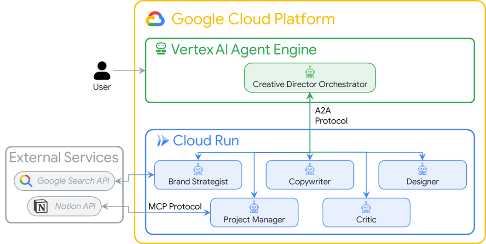

### What you'll learn

- Build LLM agents with **Google ADK** - `Agent`, system instructions, and built-in tools.
- Package reusable agent knowledge into modular files with **ADK Skills** (`SkillToolset`).
- Generate real images by bridging a text agent to an image model via a **`FunctionTool`**.
- Integrate external APIs without custom glue code using **Model Context Protocol (MCP)**.
- Turn any agent into a network-callable service using the **Agent to Agent Protocol (A2A)** over HTTPS.
- Orchestrate distributed agents with `RemoteA2aAgent` and `AgentTool`.
- Package and deploy independent agents as **Cloud Run** microservices.
- Host a stateful orchestrator on **Agent Runtime**.
- Keep long multi-agent workflows within context limits using **context compaction**.
- Build a **quality control loop**: Critic reviews output → automatic revision when needed.

### What you'll need

- A **Google Cloud project** with billing enabled
- **Owner** or **Editor** IAM role
- Basic Python knowledge

### Google Cloud Credits

> aside positive
> 
> If you are attending an **instructor-led workshop**: Your instructor will provide you with a credit code. Please use
> the one they provide.
>  
> If you are working through this Codelab **on your own**: You must use a personal account (e.g., `name@gmail.com`).
> Corporate or school-managed accounts will not work. 
>
> Redeem your free Google Cloud credits using this [link](https://goo.gle/codelab-todo-credits). You can follow the
> instructions [here](https://codelabs.developers.google.com/codelabs/cloud-codelab-credits) to activate the credit and
> create a new project.

## Set Up Your Environment

Duration: 07:00

For this codelab, we'll use Cloud Shell.

### What is Cloud Shell?

Cloud Shell is a free browser-based Linux environment with everything pre-installed: `gcloud`, `git`, Python, Docker,
and more. You don't need to install anything locally.

To open Cloud Shell, click the terminal icon in the top-right toolbar of the GCP Console:

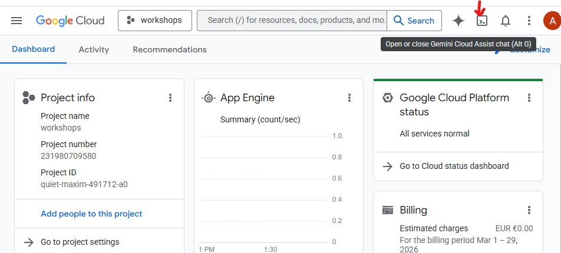

When you open Cloud Shell for the first time, you'll be prompted to verify your account - click **Verify**:

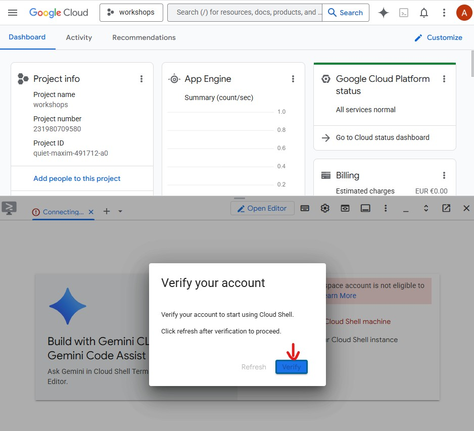

Then click **Authorize** to allow Cloud Shell to make Google Cloud API calls:

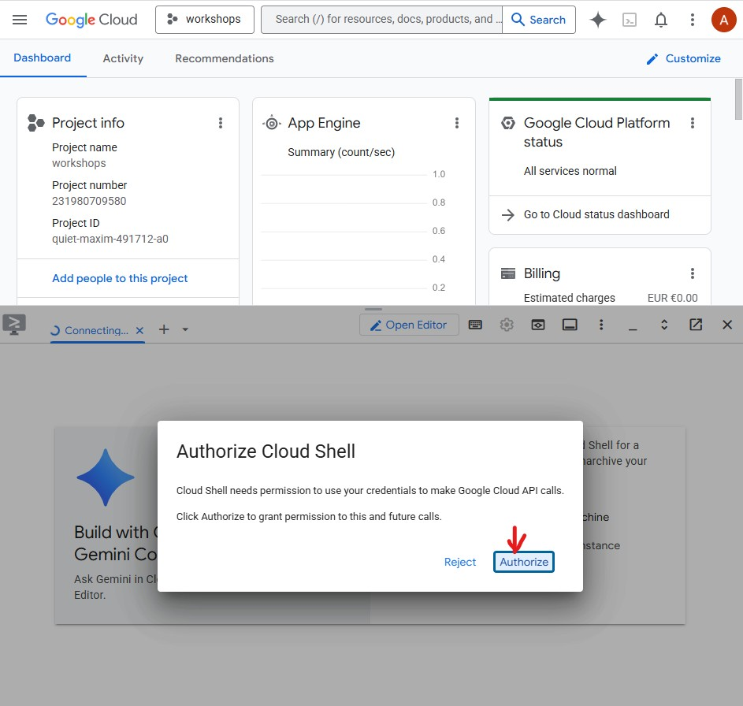

Cloud Shell is now ready. You'll see a welcome message in the terminal:

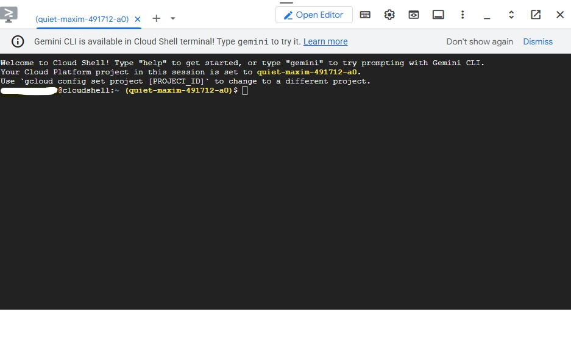

> aside negative
> 
> **Note:** If Cloud Shell goes idle for 20 minutes it will disconnect. If this happens, reconnect and `cd
> ~/ai-creative-studio/workshop/starter` to return to the working directory.

### Authenticate and configure your project

Cloud Shell is already authenticated with your Google account. Confirm your active account and find your Project ID:

```bash
gcloud config list
```

You can also see your **Project ID** in the GCP Console dashboard on the left side panel. Copy it - you'll need it in
the next command:

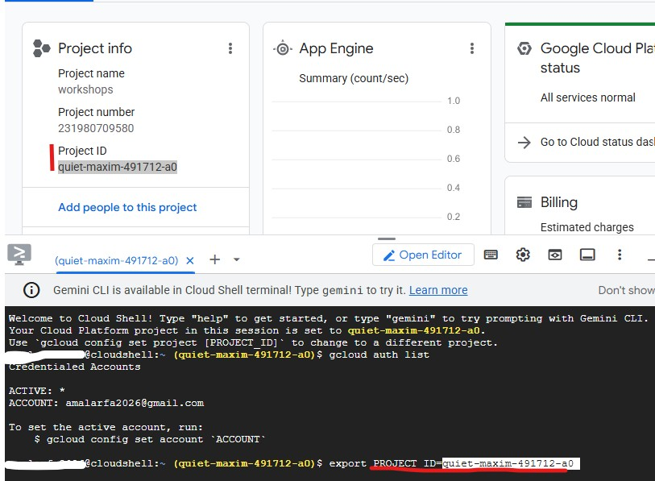

Now set your project:

```bash
export PROJECT_ID=$(gcloud config get-value project)
export REGION="us-central1"        # Cloud Run deployment region
echo "Project: $PROJECT_ID"
```

Expected output:
```text
Project: my-project-123
```
### Enable required APIs

```bash
gcloud services enable \
    aiplatform.googleapis.com \
    run.googleapis.com \
    cloudbuild.googleapis.com \
    artifactregistry.googleapis.com \
    generativelanguage.googleapis.com \
    iam.googleapis.com \
    cloudresourcemanager.googleapis.com \
    storage.googleapis.com \
    secretmanager.googleapis.com
```

This takes about 2 minutes. You'll see `Operation finished successfully` when done.

### Set up Application Default Credentials (ADC)

The agents will call Gemini Enterprise Agent Platform using the **Google Auth library**, which requires Application Default Credentials -
separate from the `gcloud` CLI authentication. 

Run this once:

```bash
gcloud auth application-default login
```

A browser tab will open asking you to confirm. Click **Allow**. You'll see:
```text
Credentials saved to file: ~/.config/gcloud/application_default_credentials.json
```

> aside positive
> 
> **Why is this needed?** `gcloud auth login` authenticates the CLI. `gcloud auth application-default login` creates
> credentials that Python applications (like your agents) use to call Google Cloud APIs. Without this, agents fail
> with `service account info is missing 'email' field`.


### Clone the starter repository

This codelab uses a **starter repository** - a skeleton project with all the infrastructure in place (Dockerfiles,
pyproject.toml, deploy scripts) but with the agent logic left for you to write.

```bash
git clone -b feature/copywriter-skills https://github.com/Saoussen-CH/ai-creative-studio-adk-a2a-mcp-vertexai-cloudrun.git ~/ai-creative-studio
cd ~/ai-creative-studio/workshop/starter
```

Each `agent.py` contains `# TODO` placeholders where you will write the agent logic. The `Dockerfile`, `pyproject.toml`, and deploy scripts are already complete.

### Configure environment variables

Copy the provided example and inject your project ID in one step:

```bash
cp .env.example .env
sed -i "s|GOOGLE_CLOUD_PROJECT=your-project-id|GOOGLE_CLOUD_PROJECT=$(gcloud config get-value project)|" .env
```

Then create the GCS bucket where the Designer will store generated images and update `.env` with its name:

```bash
export PROJECT_ID=$(gcloud config get-value project)
export BUCKET_NAME="${PROJECT_ID}-campaign-images"

gcloud storage buckets create gs://${BUCKET_NAME} \
    --location=us-central1 \
    --project=${PROJECT_ID}

sed -i "s|GCS_IMAGES_BUCKET=your-project-id-campaign-images|GCS_IMAGES_BUCKET=${BUCKET_NAME}|" .env
```

> aside positive
>
> **Why a GCS bucket?** The Designer generates images with Gemini and uploads them to GCS. Returning raw image bytes
> across A2A is impractical - a `gs://` URI is a lightweight pointer that any agent can reference. The Critic receives
> the URI and passes it to Vertex AI, which fetches the image server-side without the Critic container ever touching
> Cloud Storage directly.

> aside positive
>
> **Note:** `.env` is a hidden file (starts with `.`). Running `ls` won't show it - use `ls -a` to confirm it was
> created. The Cloud Shell Editor also hides dotfiles in its file tree, so **always open `.env` directly from the
> terminal**.

Open `.env` in the editor to review all settings:

```bash
cloudshell edit .env
```

This opens `.env` as a tab in the Cloud Shell Editor - click the **Open Editor** button in the toolbar if the editor
panel is not visible:

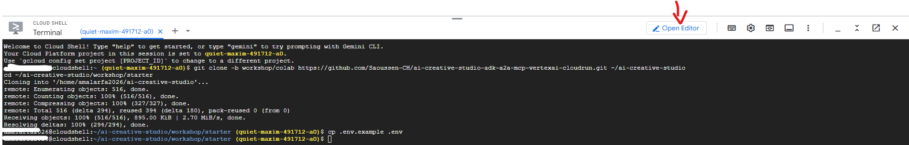

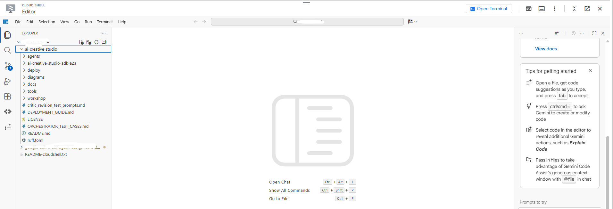

Confirm the project was set correctly:

```bash
grep GOOGLE_CLOUD_PROJECT .env
```

### Install dependencies

We use [`uv`](https://docs.astral.sh/uv/) - a fast, modern Python package manager that handles virtual environments and installs in a single tool. It's ~10-100x faster than `pip` and is the recommended way to manage Python projects.

Cloud Shell already has `uv` installed. All agents share the same core dependencies, so **install once** and it works for every agent in this codelab:

```bash
cd ~/ai-creative-studio/workshop/starter
uv sync
```

The `uv sync` command reads `pyproject.toml` and creates a `.venv/` directory with all dependencies. Each specialist also has its own `pyproject.toml` used exclusively by Docker builds - the shared install above covers everything you need for local testing.

> aside positive
>
> **No manual activation needed.** All commands in this codelab use `uv run`, which automatically activates the
> `.venv` in `~/ai-creative-studio/workshop/starter/`. Just `cd` to the `starter` directory and prefix your command
> with `uv run`.

## Understand Google ADK

Duration: 03:00

Before writing code, let's understand **Agent Development Kit (ADK)** - the framework you'll use to build every agent in
this codelab.

### What is ADK?

Agent Development Kit (ADK) is a flexible and modular framework for developing and deploying AI agents. While optimized
for Gemini and the Google ecosystem, ADK is model-agnostic, deployment-agnostic, and is built for compatibility with
other frameworks. ADK was designed to make agent development feel more like software development, to make it easier for
developers to create, deploy, and orchestrate agentic architectures that range from simple tasks to complex workflows.

ADK handles the complex parts - tool calling, multi-turn conversation, context management, streaming - so you can focus on
the agent logic.

### Building blocks of an ADK agent

Every agent is composed of four building blocks:

| Block | Role |
|---|---|
| **Model** | The LLM that reasons over goals, determines a plan, and generates responses |
| **Tools** | Functions that fetch data or perform actions by calling APIs or services |
| **Orchestration** | Maintains memory and state across turns, routes tool calls, passes results back to the model |
| **Runtime** | Executes the system when invoked - locally via `adk web`, or as a deployed service |

### Agent definition

Each of the 5 agents in this codelab is defined the same way:

```python
from google.adk.agents import Agent
from google.adk.tools.google_search_tool import google_search

root_agent = Agent(
    name="brand_strategist",                              # unique identifier
    model=os.getenv("GEMINI_MODEL", "gemini-2.5-flash"), # the LLM powering this agent
    instruction=SYSTEM_INSTRUCTION,                       # the agent's persona, constraints, and output format
    description="Brand strategist for market research, trend analysis, and competitive insights",
    tools=[google_search],                                # functions the LLM can call
)
```

| Field | Purpose |
|---|---|
| `name` | Unique ID - used by orchestrators to route calls |
| `model` | The Gemini model backing this agent |
| `instruction` | System prompt - defines the agent's role, constraints, and output format |
| `description` | One-line summary - the orchestrator reads this to decide which specialist to call |
| `tools` | Functions the LLM can invoke (built-in like `google_search`, or custom Python functions) |

### How ADK runs an agent

```text
User message
     │
     ▼
  Agent (LLM)  ← reads instruction + conversation history
     │
     ├─► needs more info? → calls a tool → gets result → continues reasoning
     │
     └─► done reasoning → returns final text response
```

The LLM decides autonomously whether to call a tool, which tool, and with what arguments. You write the instruction -
ADK handles the rest.

## Build and Test the Brand Strategist agent

Duration: 08:00

Let's start with the first agent: The Brand Strategist. This is a research only agent to search for target audience
insights, competitor analysis, and trending topics using Google Search. 

Open the skeleton agent file in Cloud Shell Editor:

```bash
cloudshell edit agents/brand_strategist/agent.py
```

You'll see two `# TODO` sections for you to fill them in. 

### TODO 1 - Write the system instruction

First, you'll write the system instruction for the agent. The system instruction is a string that defines the agent's
role, constraints, and output format. 

```python
SYSTEM_INSTRUCTION = f"""You are a Brand Strategist specializing in market research and trend analysis.

IMPORTANT: Today's date is {datetime.date.today().strftime("%B %d, %Y")}.
When conducting research, focus on current trends from {datetime.date.today().year}.
Use search queries like "[topic] trends {datetime.date.today().year}" for recent insights.

IMPORTANT: Your role is RESEARCH ONLY. You do NOT create campaign content, captions, or designs.
After providing research insights, your work is complete.

Your expertise:
- Identifying target audience insights and behaviors
- Analyzing competitor strategies
- Researching current social media trends
- Understanding platform algorithms and best practices

You have access to:
- google_search: Search the web for competitors, trends, and market insights

When given a campaign brief:
1. Use google_search to research the target audience's current interests
2. Search for and analyze 2-3 competitor brands
3. Identify 3-5 trending topics related to the product category
4. Provide high-level strategic insights - NOT specific campaign content

DO NOT create captions, copy, designs, or any campaign content.

Format your output as:
**Audience Insights:**
[Key behaviors and preferences based on research]

**Competitive Analysis:**
[What 2-3 competitors are doing - strengths and weaknesses]

**Trending Topics:**
[3-5 relevant trends to consider]

**Key Strategic Insights:**
[High-level themes and positioning opportunities]
"""
```

### TODO 2 - Create the root_agent

Next, replace the incomplete `root_agent` with:

```python
root_agent = Agent(
    name="brand_strategist",
    model=os.getenv("GEMINI_MODEL", "gemini-2.5-flash"),
    instruction=SYSTEM_INSTRUCTION,
    description="Brand strategist for market research, trend analysis, and competitive insights",
    tools=[google_search],
)
```

### Test locally with ADK web UI

Now let's test the agent using the **ADK web UI** - a built-in chat interface for testing agents before deploying to cloud.

```bash
uv run adk web agents --allow_origins='*'
```

> aside positive
>
> **Why `--allow_origins='*'`?** Cloud Shell's Web Preview proxies your local server through a `*.cloudshell.dev` URL,
> which is a different origin than `127.0.0.1`. Without this flag, the dev UI gets blocked by CORS when creating a
> session and you'll see `403 Forbidden` errors. The flag whitelists all origins - safe for local development.

> aside negative
>
> **"No agents found in current folder"?** Make sure you ran the command from `~/ai-creative-studio/workshop/starter`
> (not from inside `agents/`). The `agents` argument tells `adk web` where to look.

You'll see:
```text
INFO: Started server process
INFO: Uvicorn running on http://localhost:8000
```

The server is now running inside Cloud Shell:

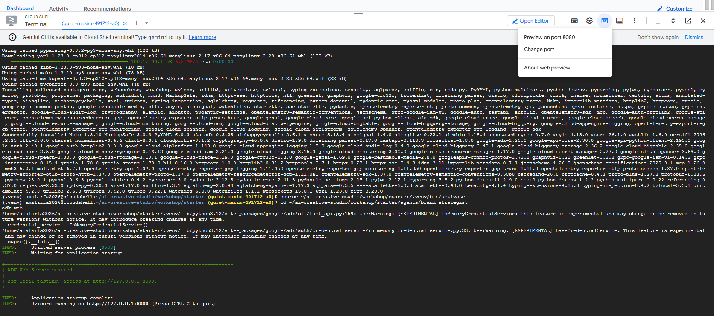

To open it in your browser, use **Web Preview**:

1. Look at the **Cloud Shell toolbar** at the top of the page
2. Click the **Web Preview** icon (looks like a box with an upward arrow, top-right of the Cloud Shell toolbar)
3. Click **"Change port"** and enter `8000`, then click **"Change and Preview"**

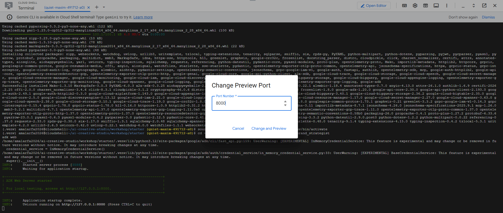

A new browser tab opens with the ADK web UI. Click the **"Select an agent"** dropdown in the top-left - you'll see all
your agents listed:

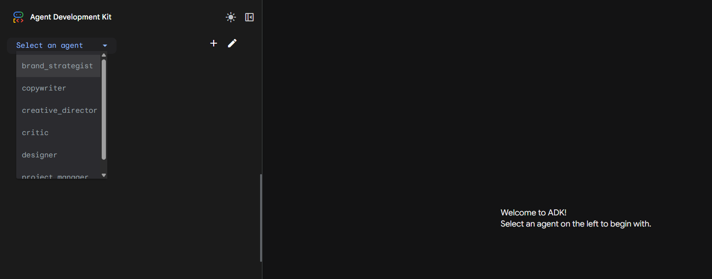

Choose `brand_strategist` to start testing:

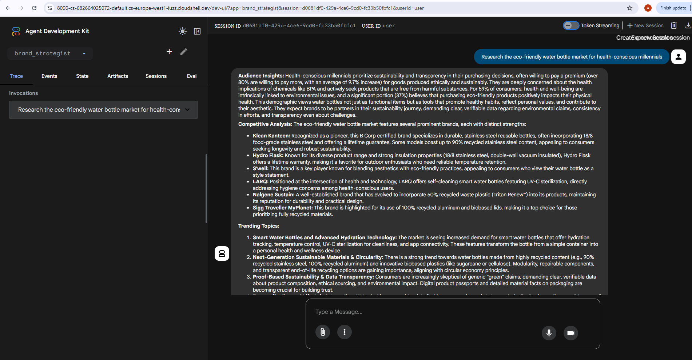

### Try these test prompts

In the ADK web UI chat box, try:

- `Research the eco-friendly water bottle market for health-conscious millennials`
- `What are the top Instagram trends in the wellness space in 2025?`

You should see the agent call Google Search and return structured research with Audience Insights, Competitive Analysis, and Trending Topics sections.

## Build the Copywriter - ADK Skills

Duration: 03:00

**Role:** Turn brand research into Instagram captions. The Copywriter creates 3 caption variations covering
different tones (inspirational, educational, community), each with hashtags and a CTA.

### Concept: ADK Skills

A naive approach would embed all platform knowledge - character limits, hashtag tiers, caption formulas, brand voice
examples - directly in the system prompt. That works, but bloats every request with content the agent only needs
occasionally.

**ADK Skills** (`SkillToolset`, introduced in ADK 1.25.0) let you package that knowledge into modular files with
three levels of loading:

- **L1 - frontmatter** (`name` + `description` in `SKILL.md`): always available, used for skill discovery
- **L2 - instructions** (body of `SKILL.md`): loaded when the agent triggers the skill
- **L3 - resources** (`references/` and `assets/` files): loaded only when the agent explicitly reads them

The system instruction shrinks to a short role statement plus "load the skill before writing". Platform details only
enter the context window when the agent actually needs them.

The Copywriter's skill lives in `agents/copywriter/skills/instagram-copywriting/`:

```text
skills/
  instagram-copywriting/
    SKILL.md                       ← L1 frontmatter (discovery) + L2 instructions (loaded on trigger)
    references/
      platform-guide.md            ← L3: character limits, hashtag tiers, algorithm signals
      caption-formulas.md          ← L3: hook formulas, CTA patterns, full caption structures
    assets/
      brand-voice-examples.md      ← L3: annotated real-world caption examples
```

### TODO - Wire the ADK Skill

Open the file directly in the Cloud Shell editor:

```bash
cloudshell edit agents/copywriter/agent.py
```

Find the three `# TODO` comments and fill them in:

```python
from google.adk.skills import load_skill_from_dir
from google.adk.tools import skill_toolset

_instagram_skill = load_skill_from_dir(
    pathlib.Path(__file__).parent / "skills" / "instagram-copywriting"
)
_copywriting_skills = skill_toolset.SkillToolset(skills=[_instagram_skill])

root_agent = Agent(
    ...
    tools=[_copywriting_skills],
)
```

Open the skill file to see how it is structured:

```bash
cloudshell edit agents/copywriter/skills/instagram-copywriting/SKILL.md
```

**Try it:** Switch the dropdown to **`copywriter`** and send:

```
You are writing captions for EcoFlow Smart Water Bottle targeting health-conscious millennials aged 25-35.
Audience insight: they prioritize sustainability, track health metrics, and share lifestyle content.
Competitor insight: Hydro Flask dominates with lifestyle branding; S'well leads on premium aesthetics.
Write 3 Instagram captions - one inspirational, one educational, one community-focused. Include 5 hashtags each and a CTA.
```

> aside positive
>
> **No shared memory.** Notice you had to paste the audience and competitor insights manually - the Copywriter has no
> idea what the Brand Strategist produced unless the orchestrator explicitly forwards it. In a multi-agent workflow,
> context passing is entirely the orchestrator's responsibility. That's the Creative Director's job, which you'll build
> next.

## Build the Designer - Multimodal Image Generation

Duration: 05:00

Keep the ADK web UI running. Use the **agent dropdown** to switch agents without restarting the server.

**Role:** Create visual concepts for each caption and generate the actual images using Gemini native image generation.
The Designer outputs 2-3 visual concepts per caption - each with a detailed prompt, style, color palette, mood, and
Instagram format - then calls the `generate_image` tool to produce a real image and upload it to GCS.

### Concept: Bridging a text agent with an image model via a tool

The Designer runs on `gemini-3.1-flash-preview` (the text model set via `GEMINI_MODEL` in `.env`), but image
generation requires a dedicated model (`gemini-3.1-flash-image-preview`). That image model doesn't support function
calling, so it can't be used directly as an ADK agent. Instead, it's wrapped in a plain Python function and
registered as a `FunctionTool`.

This is the pattern for any model or API that the LLM can't call directly: wrap it in a tool, let the agent
orchestrate when to call it, and get a structured result back.

```text
Designer agent (text model)
        │
        │  decides visual concept, writes image prompt
        ▼
  generate_image tool
        │
        │  calls gemini-3.1-flash-image-preview
        │  uploads result to GCS
        ▼
  {"status": "success", "gcs_uri": "gs://..."}
        │
        │  returned to agent, included in response
        ▼
  Critic (receives gcs_uri, passes to Vertex AI for multimodal review)
```

### TODO - Implement `generate_image`

Open the file directly in the Cloud Shell editor:

```bash
cloudshell edit agents/designer/image_gen_tool.py
```

The function signature, environment setup, and aspect ratio injection are provided. Fill in the three TODOs:

**TODO 1 - Call the Gemini image model:**

```python
        client = genai.Client(vertexai=True, project=project_id, location=location)

        response = client.models.generate_content(
            model=image_model,
            contents=prompt_with_aspect,
            config=types.GenerateContentConfig(
                response_modalities=["IMAGE", "TEXT"],
                http_options=types.HttpOptions(
                    retry_options=types.HttpRetryOptions(
                        attempts=5, exp_base=2, initial_delay=30,
                        http_status_codes=[429, 500, 503, 504],
                    ),
                    timeout=180_000,
                ),
            ),
        )
```

> aside positive
>
> **Why `initial_delay=30` here?** Image generation quota on Dynamic Shared Quota recovers slowly compared to text models. A 30-second base delay gives the shared pool time to refill between retries. The text model retry config uses `initial_delay=5` - not enough for image quota.

**TODO 2 - Extract image bytes from the response:**

```python
        image_bytes = None
        mime_type = "image/png"
        for part in response.candidates[0].content.parts:
            if part.inline_data is not None:
                image_bytes = part.inline_data.data
                mime_type = part.inline_data.mime_type or "image/png"
                break

        if not image_bytes:
            return {"status": "error", "error": "Gemini returned no image data"}
```

**TODO 3 - Upload to GCS and return the URI:**

```python
        ext = "jpg" if "jpeg" in mime_type else "png"
        from google.cloud import storage
        gcs_client = storage.Client(project=project_id)
        bucket = gcs_client.bucket(bucket_name)
        blob_name = f"campaign-images/{concept_name}-{uuid.uuid4().hex[:8]}.{ext}"
        blob = bucket.blob(blob_name)
        blob.upload_from_file(io.BytesIO(image_bytes), content_type=mime_type)
        gcs_uri = f"gs://{bucket_name}/{blob_name}"
```

**Try it:** Switch the dropdown to **`designer`** and send:

```
Create 2 visual concepts for an EcoFlow Smart Water Bottle Instagram post targeting health-conscious millennials.
Style: clean, modern, lifestyle-focused. Include prompts with color palette, mood, and format (1080x1080 or 1080x1350).
```

> aside positive
>
> **Images appear inline in `adk web`.** After uploading to GCS, `generate_image` also saves the image bytes as an
> ADK artifact via `tool_context.save_artifact(...)`. The `adk web` server uses an in-memory artifact service that
> renders these as thumbnails directly in the chat UI. On Cloud Run there is no artifact service, so the call raises
> `ValueError`, which the tool catches and ignores - the `gcs_uri` is always returned regardless.

## Build the Critic - Structured Output

Duration: 06:00

**Role:** Quality-assure copy and visuals before they're handed to the Project Manager. The Critic scores both
deliverables and returns `APPROVED` or `NEEDS_REVISION` with specific suggestions. When `gcs_uri` values are present
in the input, it calls the `review_image` tool to visually inspect each generated image before scoring.

### Concept: When to use a Pydantic model for Gemini output

The rule is about **who consumes the output**:

- **Python code consumes it** → use `response_schema` + Pydantic. Code can't handle ambiguity, so you need a guaranteed structure to extract fields reliably.
- **An LLM consumes it** → text format + system instruction is enough. LLMs understand formatting rules and tolerate variation.

In `review_image`, Python code needs `score`, `approval_status`, `what_works`, `issues`, and `suggestions` as typed values. Passing `response_schema=_GeminiReview` constrains Gemini at the API level to return valid JSON; `model_validate_json()` parses it into a typed object your code can use reliably.

```python
class _GeminiReview(BaseModel):
    score: int = Field(ge=1, le=10)
    approval_status: Literal["APPROVED", "NEEDS_REVISION"]
    what_works: str
    issues: str
    suggestions: str
```

> aside positive
>
> **Contrast:** the Critic's final review is read by the Creative Director - another LLM. A text format enforced in the system instruction is enough there. No schema needed when the consumer is an LLM, not code.

### TODO - Implement `review_image`

Open the file directly in the Cloud Shell editor:

```bash
cloudshell edit agents/critic/image_review_tool.py
```

The Pydantic models and prompt are provided. Fill in the three TODOs:

**TODO 1 - Create an image part from the GCS URI:**

```python
        image_part = types.Part.from_uri(file_uri=gcs_uri, mime_type=mime_type)
```

> aside positive
>
> **Multimodal review via GCS.** `Part.from_uri()` passes the image as a GCS reference. Vertex AI fetches it
> server-side - the Critic container never downloads the image directly, so no Cloud Storage credentials are needed
> on the Critic service.

**TODO 2 - Call Gemini with a structured response schema:**

```python
        response = client.models.generate_content(
            model=model,
            contents=[image_part, prompt],
            config=types.GenerateContentConfig(
                response_schema=_GeminiReview,
                response_mime_type="application/json",
            ),
        )
```

> aside positive
>
> **Structured output via Pydantic.** Passing `response_schema=_GeminiReview` forces Gemini to return valid JSON
> matching the Pydantic model. No regex, no prompt-engineering the format - the model is constrained at the API level.

**TODO 3 - Parse the response and return the result:**

```python
        review = _GeminiReview.model_validate_json(response.text)
        return ImageReviewResult(status="success", concept_name=concept_name, **review.model_dump())
```

**Try it:** Switch the dropdown to **`critic`** and send:

```
Review this Instagram caption for an eco-friendly water bottle brand targeting millennials:
"Hydrate smarter, live greener. 💧 Our EcoFlow bottle tracks your intake, keeps your drink cold for 24h, and never touches single-use plastic. Because what you drink from matters as much as what you drink. #EcoFlow #HydrationGoals #SustainableLiving #ZeroWaste #HealthyHabits - Shop link in bio."
Score it and indicate APPROVED or NEEDS_REVISION with specific feedback.
```

Verify the response contains `**POSTS REVIEW:**`, `Status: APPROVED` (or `NEEDS_REVISION`), and `**OVERALL ASSESSMENT:**`.
If those sections are present, the Critic is ready to plug into the orchestrator.

When you're done testing all three agents, press `Ctrl+C` to stop the server.

## Build the Project Manager Agent with MCP

Duration: 15:00

The Project Manager introduces a new concept: **MCP (Model Context Protocol)**.

Open the file:

```bash
cloudshell edit agents/project_manager/agent.py
```

This file is more complex - it has a `create_project_manager_agent()` function with two branches: one without Notion (text-only timelines) and one with the Notion MCP toolset. You'll fill in both.

### The problem MCP solves

Your agent needs to call an external service - say, create a page in Notion. You could write Python code that calls the Notion REST API directly. But then:

- Every developer writes a different wrapper
- You need to maintain custom integration code
- The LLM doesn't know the API exists unless you describe every endpoint manually

**MCP solves this** by defining a standard way for external services to expose their capabilities as **tools** an LLM can discover and call automatically.

### What is MCP?

MCP (Model Context Protocol) is an **open standard** (published by Anthropic) for connecting AI agents to external tools and data sources. It works like a universal adapter.

An MCP server is a small program that:
1. Wraps an external API (Notion, GitHub, databases, filesystems...)
2. Exposes that API as a list of typed, documented **tools**
3. Communicates with the agent via a simple protocol (stdio or HTTP)

The agent connects to the MCP server, automatically discovers the available tools, and can call them just like any other tool - the LLM sees `API-post-page(...)` as a callable function.

### A2A vs MCP - what's the difference?

This is a common point of confusion. Here's the key distinction:

| | A2A | MCP |
|---|---|---|
| **What connects** | Agent ↔ Agent | Agent ↔ External tool/service |
| **The other side is** | Another LLM agent | An API wrapper (no LLM) |
| **Example** | Creative Director calls Brand Strategist | Project Manager calls Notion API |
| **Protocol** | JSON-RPC over HTTPS | stdio or HTTP stream |
| **Defined by** | Google | Anthropic |

Think of it this way:
- **A2A** = how agents talk to other **agents**
- **MCP** = how agents talk to **tools and services**

In this project both are used together:

```text
Creative Director
    │
    │  (A2A)  Brand Strategist ─── (google_search tool built into ADK)
    │  (A2A)  Copywriter
    │  (A2A)  Designer
    │  (A2A)  Critic
    │  (A2A)  Project Manager
                   │
                   │  (MCP)  notion-mcp-server ──► Notion REST API
```

### How MCP works in this project

When the agent runs, ADK launches `notion-mcp-server` as a child process. That process exposes these tools directly to the LLM:

| Tool | What it does |
|---|---|
| `API-retrieve-a-database` | Fetches schema (property names, types, valid values) |
| `API-post-database-query` | Queries existing pages |
| `API-post-page` | Creates a new page |
| `API-patch-page` | Updates an existing page |

The LLM calls these like any other function - it has no idea they go through MCP to the Notion REST API under the hood.

### Why stdio? Why not just HTTP?

The MCP server runs as a **child process** of the agent, communicating over stdin/stdout. This means:
- No extra network port needed
- Lifecycle is managed by the agent (started on demand, stopped on exit)
- Everything ships in one Docker image - no separate service to deploy


### (Optional) Enable Notion Integration

> **You can skip this entire section.** The Project Manager agent always produces a complete text-based campaign timeline, with or without Notion. If you skip this setup, the agent falls back to in-memory mode and outputs the timeline as plain text in the chat. Nothing breaks - you just won't see tasks appear in a Notion database. **Go straight to TODO 1 if you want to skip.**

If you have a Notion account and want to see the MCP integration in action, complete the setup below now. The TODOs that follow reference Notion database IDs - this is where you get them.

#### Step 1 - Create the Notion database from a template

We use the official **Notion Projects & Tasks** template as our database. We chose this template deliberately to demonstrate a complex, real-world setting - it has multiple property types (status, date ranges, relations, selects) with non-obvious names. This is a great test of MCP's dynamic schema discovery: the agent must figure out the exact property names at runtime rather than having them hardcoded.

Click the link below to add the template to your Notion workspace:

**[→ Add "Projects & Tasks" template to Notion](https://www.notion.so/marketplace/templates/notion-projects-and-tasks?cr=pro%3Anotion)**

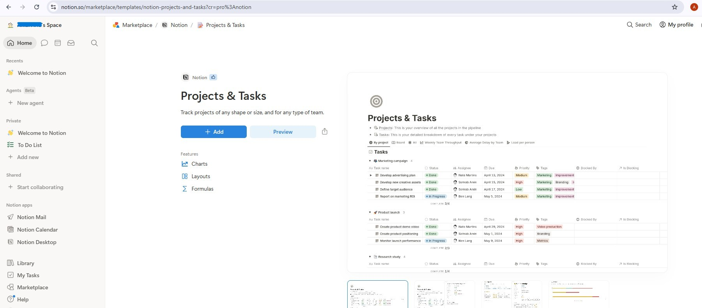

Once added, you'll have two linked databases: **Projects** and **Tasks**. The template comes with sample entries - **delete them all** before proceeding so the agent starts with a clean workspace (select all → Delete).

#### Step 2 - Create a Notion integration

**Create the integration:**

1. Go to [notion.so/my-integrations](https://www.notion.so/my-integrations)
2. Click **New Integration** → name it `AI Creative Studio`
3. Associate it with your workspace
4. Click **Configure settings** → make sure **Read content**, **Update content**, and **Insert content** capabilities are all checked

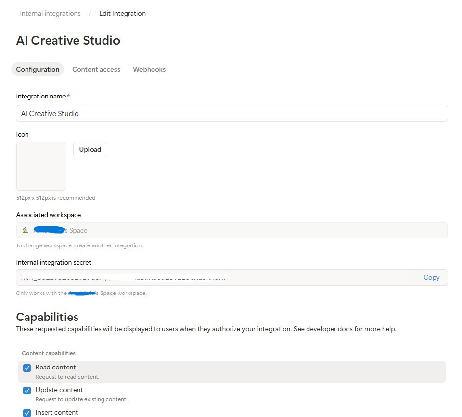

5. Copy the **Internal Integration Token** (`ntn_...`) and paste it into your `.env` file:

```bash
NOTION_TOKEN=ntn_your-token-here
```

**Connect the integration to your databases:**

6. Open the template page you just duplicated, then click into the **Projects** database
7. Click the `...` menu (top right) → **Connections** → **Add a connection** → select `AI Creative Studio`

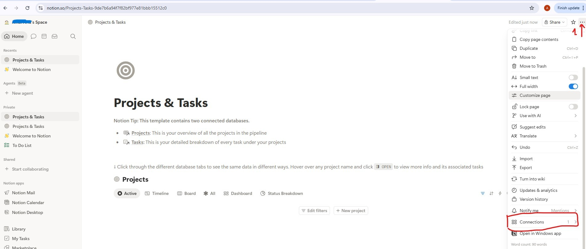

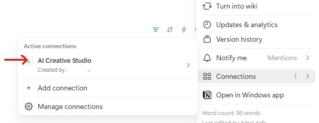

8. Do the same for the **Tasks** database

**Get the database IDs:**

9. Click the **Projects** database link to open it - it opens in its own page with a URL like:

```
https://www.notion.so/9887b6a94f7f83f68f8581e038d1aaa4?v=2c37b6a94f7f838685f1086e312c7278
```

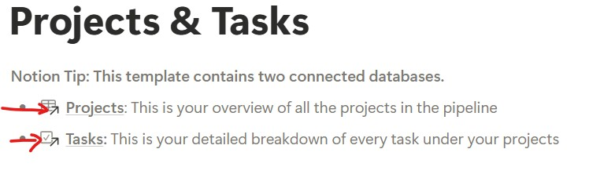

The database ID is the first UUID in the URL - everything before the `?v=`:

```
https://www.notion.so/{DATABASE_ID}?v=...
                       ^^^^^^^^^^^^^^^^
                       9887b6a94f7f83f68f8581e038d1aaa4  ← this is your DATABASE_ID
```

10. Do the same for the **Tasks** database link to get its database ID

11. Add all three values to your `.env`:

```bash
NOTION_TOKEN=ntn_your-token-here
NOTION_PROJECT_DATABASE_ID=9887b6a94f7f83f68f8581e038d1aaa4   # <-- your Projects DB ID
NOTION_TASKS_DATABASE_ID=your-tasks-db-id                      # <-- your Tasks DB ID
```

#### Step 3 - Install the Notion MCP server

The Project Manager connects to Notion via the official `@notionhq/notion-mcp-server` Node.js package. Install it globally:

```bash
npm install -g @notionhq/notion-mcp-server@1.9.1
```

Verify the install:

```bash
npm list -g @notionhq/notion-mcp-server
```

Expected output:
```text
└── @notionhq/notion-mcp-server@1.9.1
```

> **`notion-mcp-server: command not found`?** Make sure Node.js is installed (`node --version`) and that your npm global bin is on your PATH (`export PATH=$PATH:$(npm bin -g)`).

#### Step 4 - Verify your .env

Open `.env` and confirm all three Notion values are set (you added them in Step 2):

```bash
cloudshell edit .env
```

```bash
NOTION_TOKEN=ntn_...                           # integration token
NOTION_PROJECT_DATABASE_ID=...                 # Projects database ID
NOTION_TASKS_DATABASE_ID=...                   # Tasks database ID
```

The Project Manager agent automatically detects these variables at startup and enables the Notion MCP toolset.

#### How schema discovery works

The Project Manager uses **dynamic schema discovery** - it never hardcodes Notion property names:

```text
Step 1: Call API-retrieve-a-database to discover exact property names
Step 2: Read the "properties" object in the response
Step 3: Use ONLY discovered property names (case-sensitive) in API calls
Step 4: For select/status fields, use only values from the options array
```

This means the agent adapts to any Notion database structure automatically - rename your properties to French, Arabic, or anything else, and the agent still works.

---

### TODO 1 - Write the system instruction

The starter already computes `notion_section` - an empty string when Notion is not configured, or a block containing the database IDs plus full tool guidance when it is. This keeps Notion instructions entirely out of the no-Notion agent's prompt; the LLM never sees rules for tools it doesn't have.

Your job is to replace the placeholder `return` with a real system instruction that uses `{notion_section}`:

```python
    return f"""You are a Project Manager specializing in creative campaign execution.

Today's date is {datetime.date.today().strftime("%B %d, %Y")}.
Use this as the starting point for all timelines.

Your goal: create a complete project plan for the campaign.
{notion_section}
**Project Timeline:**
Phase 1: Strategy & Research | [date] → [date] | [key activities]
Phase 2: Content Creation    | [date] → [date] | [key activities]
Phase 3: Review & Revision   | [date] → [date] | [key activities]
Phase 4: Launch & Monitoring | [date] → [date] | [key activities]

**Task List:**
| Task | Owner | Deadline | Status |
[list each task with realistic deadlines from today; set Owner to TBD]

**Budget Breakdown:**
[by category with approximate allocations]

**Milestones:**
[3-5 key checkpoints with dates]

**Notion Status:**
[What happened - e.g. "Project created (ID: xxx), 8 tasks linked" or "Notion not configured - text timeline only"]
"""
```

### TODO 2 - Agent without Notion

Inside `create_project_manager_agent()`, in the `if not notion_token` branch, replace the incomplete agent with:

```python
        return Agent(
            name="project_manager",
            model=os.getenv("GEMINI_MODEL", "gemini-2.5-flash"),
            instruction=get_system_instruction(),
            description="Project manager that creates campaign timelines and task breakdowns",
        )
```

### TODO 3 - Agent with Notion MCP

First, read both database IDs at the top of `create_project_manager_agent()`:

```python
    notion_token           = os.getenv("NOTION_TOKEN")
    notion_project_db_id   = os.getenv("NOTION_PROJECT_DATABASE_ID")
    notion_tasks_db_id     = os.getenv("NOTION_TASKS_DATABASE_ID")
```

Then in the `else` branch, create the MCP toolset and the agent:

```python
        from google.adk.tools.mcp_tool import McpToolset, StdioConnectionParams
        from mcp import StdioServerParameters

        server_params = StdioServerParameters(
            command="notion-mcp-server",
            env={
                "NOTION_TOKEN": notion_token,
                "PATH": os.environ.get("PATH", ""),
            }
        )
        notion_toolset = McpToolset(
            connection_params=StdioConnectionParams(
                server_params=server_params,
                timeout=30.0
            )
        )

        return Agent(
            name="project_manager",
            model=os.getenv("GEMINI_MODEL", "gemini-2.5-flash"),
            instruction=get_system_instruction(
                project_database_id=notion_project_db_id,
                tasks_database_id=notion_tasks_db_id,
            ),
            description="Project manager with Notion integration for task tracking",
            tools=[notion_toolset],
        )
```

> **Best practice:** Never hard-fail on optional integrations. The text timeline is always the primary deliverable; Notion is supplementary.

### Test the Project Manager Locally with ADK Web

```bash
uv run adk web agents --allow_origins='*'
```

Open Web Preview on port 8000. Use the **agent dropdown** to select **`project_manager`**, then try:

```
Create a project plan for a GreenBrew organic coffee brand Instagram campaign.
Budget: $2,500. Launch in 3 weeks. Target audience: eco-conscious millennials aged 22-30.
Include phases, tasks with deadlines from today, and milestones.
```

> aside positive
>
> **Use a different campaign here.** The full orchestrator run later uses EcoFlow Smart Water Bottle. Using GreenBrew here lets you tell the two tests apart when checking Notion or reviewing outputs.

You should see a structured text timeline with phases, task list, and milestones. If Notion credentials are set in `.env`, the agent will also create entries in your Notion workspace.

---
## Understand the A2A Protocol

Duration: 05:00

We'll use Agent-to-Agent Protocol (A2A) to connect the different agents in our system. Let's understand how it works.

### The problem A2A solves

Imagine you have a Brand Strategist agent built with ADK and a Copywriter agent built with LangGraph. How does one call
the other? They speak different internal languages. You'd need to write custom glue code every time.

A2A solves this by defining a universal language that any agent - regardless of framework - can speak. It's the HTTP of
the agent world: a standard everyone agrees on so anyone can talk to anyone.

### What is A2A?

Agent-to-Agent (A2A) is an **open standard for agent communication** published by Google. It defines:
1. How an agent describes itself - agent card at `/.well-known/agent.json`
2. How another agent calls it - JSON-RPC over HTTPS
3. How results are returned - streaming or single response

What makes A2A flexible:
- Language-agnostic - Python agents can talk to TypeScript agents
- Framework-agnostic - ADK agents can talk to LangGraph or CrewAI agents
- Infrastructure-agnostic - local agents can talk to cloud agents

### How it works - step by step

```text
Creative Director                  Brand Strategist
      │                                  │
      │  1. GET /.well-known/agent.json  │
      │ ────────────────────────────────►│
      │  ◄──── agent card (name, url,    │
      │         skills, capabilities) ───│
      │                                  │
      │  2. POST /                       │
      │     {"method": "tasks/send",     │
      │      "params": {"message": ...}} │
      │ ────────────────────────────────►│
      │                                  │  LLM does
      │                                  │  the work...
      │  3. streaming response chunks    │
      │  ◄───────────────────────────────│
      │  ◄───────────────────────────────│
      │  ◄───────────────────────────────│
```

**Step 1 - Discovery:** The orchestrator fetches the agent card once to learn the agent's name, URL, and capabilities.

**Step 2 - Invocation:** The orchestrator sends a task via JSON-RPC POST. The body contains the message (the prompt for the specialist).

**Step 3 - Response:** The specialist streams back its response in chunks, just like a regular LLM call.

### The agent card

Each agent publishes a self-description at `/.well-known/agent.json`. This is like a business card - it tells the world
what the agent can do and where to reach it:

```json
{
  "name": "brand_strategist",
  "description": "Market research and competitive analysis",
  "url": "https://brand-strategist-xyz.run.app",
  "capabilities": { "streaming": true },
  "skills": [
    {
      "id": "market_research",
      "description": "Research target audiences, competitors, and trends"
    }
  ]
}
```

The orchestrator reads this card to build its `RemoteA2aAgent` object - no hardcoded knowledge of the specialist's
internals needed.

### Exposing an agent via A2A in ADK

`to_a2a()` wraps any ADK agent in an A2A-compliant FastAPI app. One line:

```python
from google.adk.a2a.utils.agent_to_a2a import to_a2a

# root_agent = your normal ADK Agent(...)
a2a_app = to_a2a(root_agent, host=PUBLIC_HOST, port=PUBLIC_PORT, protocol=PROTOCOL)
uvicorn.run(a2a_app, host=HOST, port=PORT)
```

This automatically creates:
- `/.well-known/agent.json` - the agent card
- `/` - the JSON-RPC endpoint (all A2A task requests go to the root path)

## Expose agents as A2A services

Duration: 08:00

To expose agents as A2A services, you can use the `to_a2a()` utility function from ADK. 

### How `to_a2a()` works

```python
from google.adk.a2a.utils.agent_to_a2a import to_a2a

a2a_app = to_a2a(root_agent, host=PUBLIC_HOST, port=PUBLIC_PORT, protocol=PROTOCOL)
uvicorn.run(a2a_app, host=HOST, port=PORT)
```

`to_a2a()` wraps your ADK agent in a FastAPI application that automatically exposes:
- `/.well-known/agent.json` - the agent card (name, description, capabilities)
- `/a2a/{agent_name}` - the JSON-RPC endpoint for receiving tasks

Each agent's skeleton code already includes a `__main__` block that wraps the agent in an A2A server using `to_a2a()`. You
don't need to write this code - it's provided. 

### Understanding the dual URL configuration

When you run `python agent.py`, the `__main__` block uses two separate URL configs:

```python
# Where the server actually listens (network interface):
HOST = "0.0.0.0"
PORT = 8082  # Brand Strategist (others use 8083–8086 locally)

# What gets advertised in the agent card (the address other agents use to reach it):
PUBLIC_HOST = os.getenv("PUBLIC_HOST", "localhost")
PUBLIC_PORT = int(os.getenv("PUBLIC_PORT", str(PORT)))
PROTOCOL    = os.getenv("PROTOCOL", "http")

a2a_app = to_a2a(root_agent, host=PUBLIC_HOST, port=PUBLIC_PORT, protocol=PROTOCOL)
uvicorn.run(a2a_app, host=HOST, port=PORT)
```

| Environment | `HOST:PORT` (listens) | `PUBLIC_HOST:PUBLIC_PORT` (advertised in agent card) |
|---|---|---|
| Local | `0.0.0.0:8082` | `http://localhost:8082` |
| Cloud Run | `0.0.0.0:8080` | `https://brand-strategist-xyz.run.app:443` |

Locally both point to the same machine. On Cloud Run, the container listens internally on `8080` but the agent card must advertise the public HTTPS URL - otherwise the Creative Director can't reach the specialist from outside the container.

### Start all 5 specialist A2A servers

Let's run all 5 specialists as A2A servers simultaneously, then test the Creative Director locally pointing at them.

Open **5 separate Cloud Shell terminals** (click the `+` icon in the terminal tab bar) and run one agent per terminal.

`uv run` automatically activates the `.venv` - no manual `source` needed in each terminal.

**Terminal 1 - Brand Strategist (port 8082):**
```bash
cd ~/ai-creative-studio/workshop/starter
PORT=8082 uv run agents/brand_strategist/agent.py
```

**Terminal 2 - Copywriter (port 8083):**
```bash
cd ~/ai-creative-studio/workshop/starter
PORT=8083 uv run agents/copywriter/agent.py
```

**Terminal 3 - Designer (port 8084):**
```bash
cd ~/ai-creative-studio/workshop/starter
PORT=8084 uv run agents/designer/agent.py
```

**Terminal 4 - Critic (port 8085):**
```bash
cd ~/ai-creative-studio/workshop/starter
PORT=8085 uv run agents/critic/agent.py
```

**Terminal 5 - Project Manager (port 8086):**
```bash
cd ~/ai-creative-studio/workshop/starter
PORT=8086 uv run agents/project_manager/agent.py
```

### Set localhost URLs in .env

In **Terminal 6**, update `.env` with the local agent URLs so the Creative Director can find them:

```bash
cd ~/ai-creative-studio/workshop/starter

sed -i \
  -e 's|STRATEGIST_AGENT_URL=.*|STRATEGIST_AGENT_URL=http://localhost:8082|' \
  -e 's|COPYWRITER_AGENT_URL=.*|COPYWRITER_AGENT_URL=http://localhost:8083|' \
  -e 's|DESIGNER_AGENT_URL=.*|DESIGNER_AGENT_URL=http://localhost:8084|' \
  -e 's|CRITIC_AGENT_URL=.*|CRITIC_AGENT_URL=http://localhost:8085|' \
  -e 's|PM_AGENT_URL=.*|PM_AGENT_URL=http://localhost:8086|' \
  .env
```

### Inspect agents with the A2A Inspector

The **A2A Inspector** is an open-source developer tool that speaks the A2A protocol natively. It lets you connect directly to any running A2A agent, read its agent card, and send tasks - all without writing any client code.

**What it shows you:**

- **Agent card** - the structured metadata your agent advertises: its name, description, supported input/output modes, and the endpoint URL. This is what the Creative Director reads when it discovers a specialist.
- **Chat interface** - send any message to the agent over A2A and see the raw response. You can test prompts in isolation before wiring agents together.
- **Protocol validation** - the inspector checks that the agent card conforms to the A2A spec, surfacing missing fields or malformed responses early.

**Why this matters:** When you deploy to Cloud Run later, the Creative Director discovers each specialist by fetching its agent card from `/.well-known/agent.json`. If that card is wrong - bad URL, missing capabilities - the orchestrator silently fails. The inspector lets you catch these issues locally before any cloud deployment.

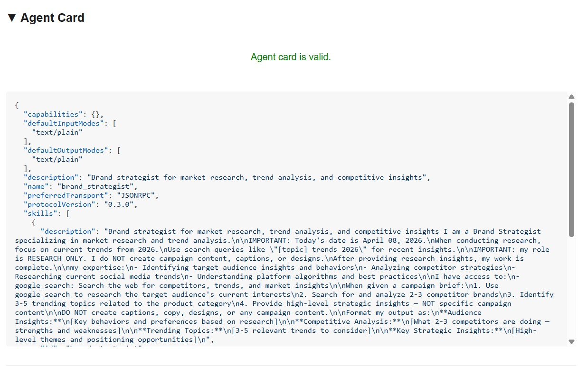

The agent card shows the specialist's identity and capabilities exactly as other agents see them.

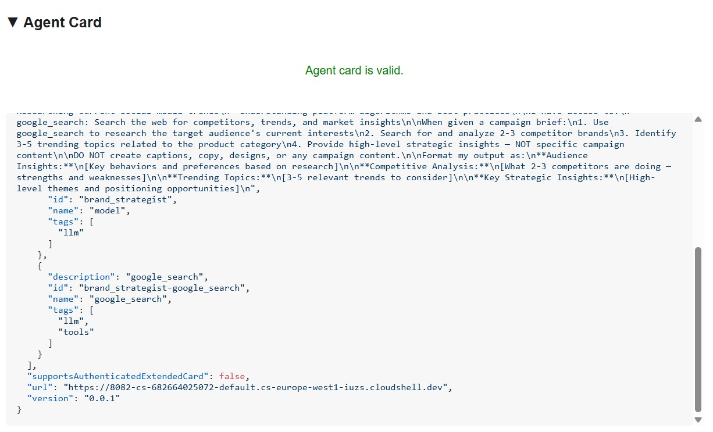

#### Install and start the inspector

> aside negative
> 
> **Cloud Shell disk space:** The A2A Inspector installation requires ~500MB. Cloud Shell's home directory has a 5GB limit shared across all your projects. If you hit an "out of space" error, free up space first:
> ```bash
> df -h ~
> pip cache purge
> rm -rf ~/.cache/uv
> ```

```bash
cd ~/ai-creative-studio/workshop
./setup_inspector.sh
```

> aside positive
> 
> **Download timeout?** Cloud Shell has intermittent outbound bandwidth limits. Retry with a longer timeout:
> ```bash
> UV_HTTP_TIMEOUT=120 ./setup_inspector.sh
> ```

The `.env` update is a one-time command. Use **Terminal 6** to start the inspector next:

```bash
cd ~/a2a-inspector
bash scripts/run.sh
```

To open the inspector UI, use **Web Preview** → **Change port** → type `5001`.

#### Connect to the Brand Strategist

Enter `http://localhost:8082` in the inspector's URL field and click **Connect**. The inspector fetches the agent card and displays the specialist's metadata.

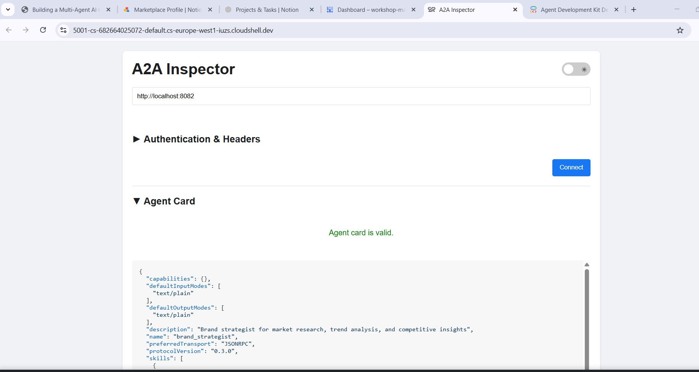

#### What the agent card tells you

The agent card is more than metadata - it's the full capability contract the agent advertises to the network. Connect to the **Project Manager** (`http://localhost:8086`) to see the richest example:

```json
{
  "name": "project_manager",
  "description": "Project manager with Notion integration for task tracking",
  "protocolVersion": "0.3.0",
  "defaultInputModes": ["text/plain"],
  "defaultOutputModes": ["text/plain"],
  "skills": [
    {
      "id": "project_manager",
      "name": "model",
      "tags": ["llm"],
      "description": "... full system instruction including today's date and Notion database IDs ..."
    },
    {
      "id": "project_manager-API-post-page",
      "name": "API-post-page",
      "tags": ["llm", "tools"],
      "description": "Notion | Create a page"
    },
    {
      "id": "project_manager-API-retrieve-a-database",
      "name": "API-retrieve-a-database",
      "tags": ["llm", "tools"],
      "description": "Notion | Retrieve a database"
    }
  ]
}
```

Three things stand out:

**1. MCP tools become A2A skills** - Every Notion tool the Project Manager has access to (`API-post-page`, `API-retrieve-a-database`, etc.) is listed as a separate skill in the agent card. Any other agent on the network can discover exactly what tools this agent can use - without reading any code.

**2. The system instruction is embedded** - The first skill's `description` contains the full system instruction, including today's date and the Notion database IDs. This is how the Creative Director knows what to pass when it calls the Project Manager.

**3. The URL is the live endpoint** - The `url` field is exactly what `RemoteA2aAgent` uses when the Creative Director calls this specialist. If the URL in the card is wrong, the orchestrator can't reach the agent.

This is why the inspector is a powerful debugging tool: one glance at the agent card tells you if the agent is running, what tools it has, and whether the endpoint is correct.

#### Send a test message

Once connected, type a prompt in the chat panel and send it. The inspector submits it as an A2A task and streams the response back - the same way the Creative Director will call this agent in production.

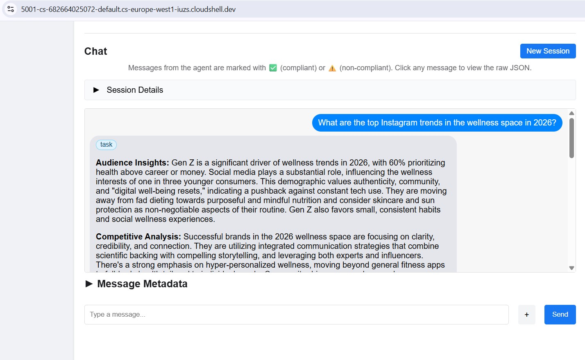

> Point the inspector at any local port (8082–8086) to test each specialist individually.

## Build the Creative Director Orchestrator

Duration: 15:00

The Creative Director is the master orchestrator. It reads specialist URLs from environment variables, wraps each one as a `RemoteA2aAgent`, and exposes them as `AgentTool`s the LLM can call.

Make sure the 5 specialist agents are still running (Terminals 1–5 from Step 10).

In **Terminal 6** (the A2A Inspector terminal), stop the inspector with `Ctrl+C`. 

Open the file:

```bash
cd ~/ai-creative-studio/workshop/starter
cloudshell edit agents/creative_director/agent.py
```

This file has three TODOs. Work through them in order.

### TODO 1 - Review the already written system instruction

The system instruction lives in `prompt.py` in the same directory - it's imported automatically:

```python
from .prompt import SYSTEM_INSTRUCTION_TEMPLATE
```

Open `prompt.py` to read it before moving on:

```bash
cloudshell edit agents/creative_director/prompt.py
```

Understanding it is important because it controls the entire orchestration behavior.

### Why the orchestrator prompt controls everything

> Open `prompt.py` alongside this section - the examples below reference specific parts of it.

The prompt in `prompt.py` is not just documentation - it's the control plane of the entire system. A poorly structured orchestrator prompt produces: agents called out of order, content generated by the orchestrator instead of specialists, workflows that continue after failures, and context silently dropped between agents. These nine elements prevent the most common failures:

**Element 0 - Plan first, then execute**

This is the most critical element. Before calling any specialist, the orchestrator is instructed to output a numbered plan:

```text
I'll create your campaign by coordinating the specialist agents in sequence:
1. Brand Strategist - develop positioning and audience insights
2. Copywriter - write captions using those insights
3. Visual Designer - create image prompts aligned with the copy
4. Critic - review and score the full package
5. Project Manager - build the timeline and task breakdown
```

Without this step, the LLM jumps straight into tool calls and loses track of where it is in the workflow - especially after receiving a long response from a specialist. Outlining the plan first anchors the orchestrator: it knows what step it's on, what comes next, and what a complete run looks like. Skipping this causes the orchestrator to stall mid-workflow or repeat steps.

**Element 1 - Explicit role definition**

```text
❌ "You are a helpful creative assistant."
✅ "You orchestrate specialists. You do NOT write captions, designs, or timelines yourself."
```

Without the explicit prohibition, the LLM will sometimes skip calling specialists and generate content directly - it's faster and it "knows" how to do it. The instruction must make this wrong.

**Element 2 - Tool calling syntax with wrong patterns listed**

Showing only correct syntax isn't enough. The LLM can generate calls that look plausible but fail silently. The prompt explicitly lists both the correct pattern and the ones that must never be used:

```text
✅ copywriter(request="...")          ← correct
❌ print(copywriter(...))             ← breaks silently
❌ default_api.copywriter(...)        ← breaks silently
❌ copywriter.run(...)                ← breaks silently
❌ agents.copywriter(...)             ← breaks silently
```

Listing the wrong patterns explicitly reduced malformed tool calls by ~95% in production.

**Element 3 - Sequential execution spelled out step by step**

```text
a) Call the tool
b) Wait for tool_output
c) Verify the output is not an error
d) Confirm to the user: "✓ Brand Strategist complete"
e) Then move to the next agent
```

Without steps (b) and (c), the LLM will sometimes call two agents simultaneously, or assume success and move on before receiving the response.

**Element 4 - Error directives: STOP, report, do not proceed**

In early versions, the orchestrator would receive an error from one specialist, fabricate a plausible output for it, and continue to the next agent. The user got a complete-looking campaign built on a hallucinated foundation. The fix is explicit: *STOP immediately. Report the exact error. Never continue.*

**Element 5 - Context passing rules**

Remote agents have **no conversation history**. When the orchestrator calls the Copywriter via A2A, the Copywriter sees only the message in that single request - it has no idea what the Brand Strategist said. The orchestrator must explicitly bundle prior outputs into each subsequent call:

```text
copywriter(request="Create 3 posts for EcoFlow water bottle targeting millennials.
Use these insights from the Brand Strategist: [paste full strategist output here].
Create engaging captions with hashtags.")
```

The instruction says this explicitly: *"Remote agents have NO shared memory - you must pass prior outputs explicitly."* Without this, each agent works blind.

**Element 6 - Request classification: simple vs. complex**

Not every request needs all five agents. The prompt instructs the orchestrator to classify the request before planning:

```text
SIMPLE  → one agent needed
  "Research the eco-friendly water bottle market" → brand_strategist only
  "Write 3 Instagram captions"                    → copywriter only

COMPLEX → all agents sequentially
  "Create a complete campaign with timeline"      → all 5 agents
```

Without this classification, the orchestrator would run all five agents for every request - including "just give me 3 post ideas" - adding unnecessary latency and cost.

**Element 7 - Communication rules: show full outputs, no filtering**

The prompt is explicit that the orchestrator must not summarize or edit what specialists return:

```text
- DO NOT summarize unless the output exceeds 2000 words
- DO NOT filter or edit agent responses
- Show the user exactly what each specialist produced
- NEVER say results are ready unless you received them in tool_output
```

Without this, the orchestrator rewrites specialist outputs in its own words - losing detail, introducing errors, and defeating the purpose of having specialists at all.

**Element 8 - Workflow completion: never stop early**

A subtle but critical failure mode: the orchestrator announces a 5-step plan, completes 3 steps, then presents results as if done. The prompt prevents this with an explicit checklist that must pass before the orchestrator can finish:

```text
✓ Did I announce a plan with N agents?
✓ Have I called ALL N agents from my plan?
✓ Did each agent respond successfully?
✓ Am I presenting complete results from ALL agents?

If any answer is NO → continue executing the remaining agents.
```

This stops the orchestrator from treating a partial run as complete.

---

### The Quality Control Loop

The revision workflow is the most complex part of `prompt.py`. Open the `## REVISION WORKFLOW` section and follow along.

#### How it works

After the Critic responds, the Creative Director does not blindly continue to the Project Manager. It reads the Critic's output and branches:

```text
Critic output
      │
      ├── "All Approved: YES"
      │         └──► proceed to Project Manager
      │
      └── "Status: NEEDS_REVISION"
                │
                ├── posts fail   → call copywriter again with feedback
                ├── visuals fail → call designer again with feedback
                └── both fail    → call copywriter, then designer
                          │
                          └──► revised output → Project Manager
                               (1 revision max per deliverable)
```

#### This is LLM-driven, not code-driven

The codelab mentioned earlier that the orchestrator "parses" the Critic's response. There is no Python code doing this parsing - no regex, no string matching. The Creative Director is an LLM reading its own instruction. That instruction says:

```text
Look for "Status: NEEDS_REVISION" in the critic's response.
Posts need revision  → call copywriter
Visuals need revision → call designer
```

The LLM reads those exact strings in the Critic's output and follows the branch. This is why the Critic format is non-negotiable: if the Critic writes "needs some work" instead of `NEEDS_REVISION`, the LLM finds no match in its instruction and silently skips the revision step.

#### How context is forwarded in a revision call

The revision call follows the same context-passing rule from Element 5 - the orchestrator must include everything explicitly because the Copywriter has no memory of its first version:

```text
"I need you to revise the Instagram posts based on critic feedback.

ORIGINAL BRIEF:
[the original user request]

YOUR FIRST VERSION:
[the posts the copywriter created]

CRITIC FEEDBACK (Score: 6/10 - NEEDS_REVISION):
[the critic's specific suggestions]

Please revise the posts addressing this feedback while maintaining
the strengths the critic identified."
```

Without the "YOUR FIRST VERSION" section, the Copywriter would write from scratch instead of improving what it already produced.

#### The 1-revision limit and why it matters

After one revision round, the orchestrator proceeds to the Project Manager regardless of the score. The instruction tracks this mentally:

```text
After calling copywriter for revision once:
→ mark "copywriter_revised = true" in context
→ even if the critic still suggests changes, proceed to PM
```

Without this limit, the loop could run indefinitely: Critic flags an issue → Copywriter revises → Critic flags again → Copywriter revises again. Each round costs tokens and time. One revision is enough to improve quality without risk of a runaway cycle.

#### What gets passed to the Project Manager

The Project Manager always receives the final approved versions, not the originals. If revisions happened, the orchestrator passes the revised copy and visuals. If everything was approved on the first pass, it passes those directly. The PM never sees rejected drafts.

---

### TODO 2 - Register each specialist as a RemoteA2aAgent + AgentTool

Find the `# TODO: For each specialist URL...` comment and replace it with:

```python
    if strategist_url:
        available_agents_list.append(
            "- **brand_strategist**: Market research, competitor analysis, trend identification"
        )
        strategist_agent = RemoteA2aAgent(
            name="brand_strategist",
            description="Researches markets, competitors, and trends using Google Search",
            agent_card=f"{strategist_url}/.well-known/agent.json",
        )
        agent_tools.append(AgentTool(agent=strategist_agent))

    if copywriter_url:
        available_agents_list.append(
            "- **copywriter**: Instagram captions, hashtags, and CTAs"
        )
        copywriter_agent = RemoteA2aAgent(
            name="copywriter",
            description="Creates Instagram captions with hashtags and CTAs",
            agent_card=f"{copywriter_url}/.well-known/agent.json",
        )
        agent_tools.append(AgentTool(agent=copywriter_agent))

    if designer_url:
        available_agents_list.append(
            "- **designer**: Visual concepts and real images generated via Gemini (GCS URIs returned)"
        )
        designer_agent = RemoteA2aAgent(
            name="designer",
            description="Creates visual concepts and generates real images via Gemini, stored in GCS",
            agent_card=f"{designer_url}/.well-known/agent.json",
        )
        agent_tools.append(AgentTool(agent=designer_agent))

    if critic_url:
        available_agents_list.append(
            "- **critic**: Quality review with APPROVED/NEEDS_REVISION scoring"
        )
        critic_agent = RemoteA2aAgent(
            name="critic",
            description="Reviews campaign materials and returns structured quality feedback",
            agent_card=f"{critic_url}/.well-known/agent.json",
        )
        agent_tools.append(AgentTool(agent=critic_agent))

    if pm_url:
        available_agents_list.append(
            "- **project_manager**: Project timelines, task breakdowns, Notion integration"
        )
        pm_agent = RemoteA2aAgent(
            name="project_manager",
            description="Creates project timelines and task breakdowns, optionally in Notion",
            agent_card=f"{pm_url}/.well-known/agent.json",
        )
        agent_tools.append(AgentTool(agent=pm_agent))
```

### TODO 3 - Wrap in an App with context compaction

#### Why compaction is necessary

Every message in a conversation - the user's prompt, every tool call, every tool response - gets appended to the context window that the LLM reads on the next turn. In a 5-agent workflow this accumulates fast:

```text
Turn 1:  user prompt                           ~200 tokens
Turn 2:  orchestrator plan                     ~300 tokens
Turn 3:  brand_strategist tool_call            ~150 tokens
Turn 4:  brand_strategist tool_output          ~1,500 tokens  ← full research report
Turn 5:  copywriter tool_call                  ~300 tokens    ← must include strategist output
Turn 6:  copywriter tool_output                ~2,000 tokens  ← 3 captions
Turn 7:  designer tool_call                    ~500 tokens
Turn 8:  designer tool_output                  ~1,500 tokens
...
```

By Agent 4 (Critic), the context window contains the full output of all three previous agents - often 8,000–12,000 tokens just in tool responses. Even with Gemini 2.5 Pro's large context window, the orchestrator's reasoning quality degrades as it has to attend over an ever-growing history. Without compaction, long workflows hit practical limits around Agent 4.

#### What compaction does

Instead of keeping every event in full, ADK periodically calls an LLM to summarize older events into a compact representation. Only the summary of past events + the full output of the most recent agent are kept in context.

```text
Without compaction:
  [full strategist output] + [full copywriter output] + [full designer output] + → Critic

With compaction (interval=3, overlap=1):
  [summary of strategist + copywriter] + [full designer output] + → Critic
```

The summary preserves the essential facts (key insights, approved captions, visual concepts) while discarding the verbose formatting, repeated context passed to each agent, and intermediate reasoning. The Critic still has everything it needs to evaluate - it just reads a summary instead of three full reports.

#### The code

Find the `# TODO: Wrap the agent in an App...` comment and replace the placeholder `App(...)` with:

```python
    from google.adk.apps import App
    from google.adk.apps.app import EventsCompactionConfig
    from google.adk.apps.llm_event_summarizer import LlmEventSummarizer
    from google.adk.models import Gemini

    compaction_config = EventsCompactionConfig(
        summarizer=LlmEventSummarizer(llm=Gemini(model_id=os.getenv("GEMINI_MODEL", "gemini-2.5-flash"))),
        compaction_interval=3,   # Summarize after every 3 agent completions
        overlap_size=1,          # Keep the most recent agent's output in full
    )

    app = App(
        name="creative_director",
        root_agent=agent,
        events_compaction_config=compaction_config,
        plugins=[LoggingPlugin()],
    )
    return agent, app
```

**`compaction_interval=3`** - compaction fires after every 3 agent completions. For a 5-agent pipeline this means it fires once (after agents 1–3), then the Critic and PM see a summary of 1–3 plus the full previous agent's output.

**`overlap_size=1`** - the most recent agent's full output is always kept verbatim, never summarized. This matters because the Critic needs the Designer's full output - including the `gcs_uri` values - to load and review the actual images. A summary would lose those URIs.

**How it plays out in a full campaign run:**

```text
Agent 1 (Strategist)  → full context
Agent 2 (Copywriter)  → full context
Agent 3 (Designer)    → full context
                        ↓ compaction fires: summarizes agents 1-2, keeps 3 in full
Agent 4 (Critic)      → sees [summary of 1-2] + [full output of 3]
Agent 5 (PM)          → sees [summary of 1-3] + [full output of 4]
```

> aside positive
> 
> **Rule of thumb:** Set `compaction_interval` to roughly half the total number of agents. Set `overlap_size=1` unless
> the next agent needs the full detail of more than one predecessor.

### Understanding `RemoteA2aAgent`and `AgentTool`

```text
RemoteA2aAgent("brand_strategist", agent_card=url)
     │
     │  wraps the remote service so ADK can call it
     ▼
AgentTool(agent=strategist_agent)
     │
     │  exposes it as a callable tool to the LLM
     ▼
Agent(tools=[...])
     │
     │  LLM calls tool("brand_strategist", message=...) when needed
     ▼
brand-strategist-xxxx.run.app  ← actual HTTP A2A call happens here
```

The LLM decides *when* to call each tool based on the system instruction and the user's request. The orchestrator never calls agents directly in code - it's all driven by the LLM's reasoning.

### Test the Creative Director locally


```bash
uv run adk web agents --allow_origins='*'
```

Open Web Preview on port 8000. Use the **agent dropdown** to select **`creative_director`**, then try:

```
Research the eco-friendly water bottle market for health-conscious millennials
```

You'll see that the Creative Director will route this to the Brand Strategist only and you'll get a response from the
Brand Strategist. 

For the full campaign, try the following:

```
Create a complete Instagram campaign for SolarPack portable solar charger targeting
outdoor enthusiasts and digital nomads aged 22-35.
Budget $2,000, launch in 2 weeks.
```

You'll see the Creative Director coordinate all 5 specialists in sequence, with each agent's output flowing into the next.


> aside negative
> 
> **`service account info is missing 'email' field`?** Your Application Default Credentials expired (Cloud Shell
> sessions reset after ~12 hours). Run `gcloud auth application-default login`, then **restart all running agents** -
> existing processes don't pick up new credentials automatically.

Stop the Creative Director (`Ctrl+C`) before proceeding - the A2A inspector also uses port 8000.

Stop the 5 specialist servers (`Ctrl+C` in each terminal) when done with local testing.

## Deploy and Test the Specialist Agents

Duration: 13:00

We're now ready to deploy our agents to Google Cloud. Cloud Run is a great service to deploy agents to. It's serverless,
scalable, and easy to use. Each specialist agent is deployed as an independent Cloud Run service.

### Deployment configuration

The `Dockerfile` for each specialist follows this pattern:

```dockerfile
FROM python:3.12-slim
WORKDIR /app
RUN apt-get update && apt-get install -y --no-install-recommends gcc curl

# Fast dependency install with uv
COPY --from=ghcr.io/astral-sh/uv:latest /uv /usr/local/bin/uv
COPY pyproject.toml .
RUN uv sync --no-install-project --no-dev

COPY . .
RUN useradd -m -u 1000 appuser && chown -R appuser:appuser /app
USER appuser

ENV PYTHONUNBUFFERED=1 PORT=8080 HOST=0.0.0.0
EXPOSE 8080
CMD ["uv", "run", "python", "agent.py"]
```

### Deploy all 5 specialists sequentially

```bash
cd ~/ai-creative-studio/workshop/starter
source .env

uv run deploy/deploy_all_specialists.py
```

This script deploys all 5 agents one at a time (~10-12 minutes total). Sequential deployment avoids the Cloud Build
polling quota (60 requests/minute). When complete, it writes each agent's Cloud Run URL back to `.env`.

After the Designer is deployed, the script automatically grants its Cloud Run service account
`roles/storage.objectCreator` on your GCS bucket so it can upload generated images.

If you configured Notion credentials in `.env`, the script also stores them securely in
**Secret Manager** (as `notion-token`, `notion-project-db-id`, `notion-tasks-db-id`) and
injects them into the Project Manager service via `--set-secrets` rather than plain environment
variables. This means the token never appears in Cloud Run's environment tab or in `gcloud`
command history.

> aside negative
>
> **Note:** The deploy script uses `--allow-unauthenticated`, making each service publicly accessible without a token.
> This is intentional for this workshop. For production, remove this flag and add IAM-based authentication.

### Verify deployments

When deployment completes, the script automatically writes the Cloud Run URLs back to `.env`, replacing the localhost
URLs from the previous step:

```bash
source .env

echo "Deployed URLs:"
echo "  Brand Strategist: $STRATEGIST_AGENT_URL"
echo "  Copywriter:       $COPYWRITER_AGENT_URL"
echo "  Designer:         $DESIGNER_AGENT_URL"
echo "  Critic:           $CRITIC_AGENT_URL"
echo "  Project Manager:  $PM_AGENT_URL"
```

The Creative Director will automatically use these Cloud Run URLs when deployed to Agent Runtime in the next step.

### Verify agent cards

Each deployed agent exposes an agent card at `/.well-known/agent.json`. Fetch them to confirm everything is live:

```bash
source .env

for agent_url in $STRATEGIST_AGENT_URL $COPYWRITER_AGENT_URL $DESIGNER_AGENT_URL $CRITIC_AGENT_URL $PM_AGENT_URL; do
    echo "=== Agent Card: $agent_url ==="
    curl -s "${agent_url}/.well-known/agent.json" | python3 -m json.tool | grep -E '"name"|"url"|"description"'
    echo ""
done
```

Expected output for each agent:
```json
"name": "brand_strategist",
"url": "https://brand-strategist-xxxx.run.app",
"description": "Brand strategist for market research and competitive insights"
```


### Test with A2A Inspector (Cloud Run)

The A2A Inspector is already installed from Step 10. Start it:

```bash
cd ~/a2a-inspector
bash scripts/run.sh
```

Open Web Preview → **Change port** → `5001`. Enter your Cloud Run URL in the connection field:

```
https://brand-strategist-xxxx.us-central1.run.app
```

Click **Connect** - no auth token needed since services are deployed with `--allow-unauthenticated`.

The inspector connects, validates the agent card, and lets you chat interactively over A2A.

> aside positive
> 
> The same applies to every specialist - just enter its Cloud Run URL.

#### Inspect agents deployed to Cloud Run

After deploying to Cloud Run, point the inspector at the public HTTPS URL to verify the cloud deployment is working:

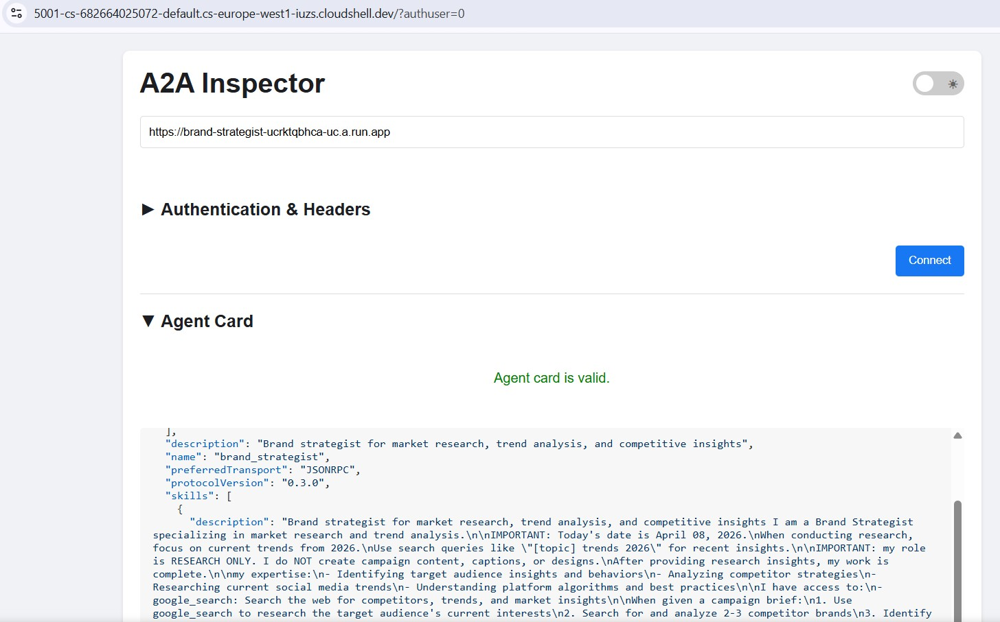

The workflow is identical - paste the Cloud Run URL, connect, and send a test message. If the agent card loads and the chat responds, the specialist is correctly deployed and reachable.

## Deploy the Creative Director to Agent Runtime

Duration: 8:00

The orchestrator is deployed to **Agent Runtime**, which provides managed session state, automatic scaling, and
built-in tracing.

### Why Agent Runtime for the orchestrator?

The five specialists are deployed to Cloud Run - lightweight, stateless, each handling one task. The Creative Director
has different requirements:

| Requirement | Why it matters |
|---|---|
| **Session state** | A multi-step workflow takes 45+ seconds. Agent Runtime maintains the conversation state between the orchestrator's tool calls so nothing is lost mid-pipeline. |
| **Variable load** | Sometimes one campaign per hour, sometimes many in parallel. Agent Runtime scales to zero when idle and scales out automatically - you don't pay for idle capacity. |
| **Observability** | Cloud Logging, Cloud Monitoring, and Cloud Trace come built in. You can see every A2A call, every token used, every latency spike - without adding any instrumentation. |
| **Long-running workflows** | Cloud Run has a 3600s request timeout. Agent Runtime is designed for workflows that can take minutes, with managed retries and state persistence. |

Cloud Run is the right platform for stateless specialists. Agent Runtime is the right platform for the stateful orchestrator.

### Deploy the orchestrator

> aside negative
> 
> **Open a new terminal for this step** and re-export your project variables - after working across multiple terminals, the shell environment may not have them set:
> ```bash
> export PROJECT_ID=$(gcloud config get-value project)
> export REGION="us-central1"
> ```

```bash
cd ~/ai-creative-studio/workshop/starter
source .env

uv run deploy/deploy_orchestrator.py --action deploy
```

This takes ~5–10 minutes. When complete, the `AGENT_ENGINE_ID` and `AGENT_ENGINE_RESOURCE_NAME` are saved to `.env`.

```bash
source .env
echo "Agent Engine ID: $AGENT_ENGINE_ID"
echo "Resource: $AGENT_ENGINE_RESOURCE_NAME"
```

### How the deployment works

`client.agent_engines.create()` packages your `App` object, uploads it with its dependencies, and deploys it to managed
infrastructure. Here's what each parameter does:

```python
import vertexai
from vertexai import Client, agent_engines

vertexai.init(project=PROJECT_ID, location=LOCATION, staging_bucket=STAGING_BUCKET)

# Wrap the App in an AdkApp adapter - enables tracing in Cloud Trace
adk_app = agent_engines.AdkApp(app=root_app, enable_tracing=True)

# Initialize client and deploy
client = Client(project=PROJECT_ID, location=LOCATION)

agent_engine_resource = client.agent_engines.create(
    agent=adk_app,
    config={
        "staging_bucket": STAGING_BUCKET,   # GCS bucket for packaging artifacts
        "display_name": "Creative Director",
        # Python packages installed in the managed runtime - pin for reproducibility
        "requirements": [
            "google-cloud-aiplatform[agent_engines]>=1.132.0,<2.0.0",
            "google-adk[a2a]==1.31.1",
            "google-genai>=1.51.0",
            "python-dotenv>=1.0.0",
        ],
        # Specialist URLs passed as env vars - the orchestrator reads these at runtime
        "env_vars": {
            "COPYWRITER_AGENT_URL": COPYWRITER_URL,
            "DESIGNER_AGENT_URL":   DESIGNER_URL,
            "STRATEGIST_AGENT_URL": STRATEGIST_URL,
            "CRITIC_AGENT_URL":     CRITIC_URL,
            "PM_AGENT_URL":         PM_URL,
        },
    },
)

resource_name = agent_engine_resource.api_resource.name
agent_engine_id = resource_name.split("/")[-1]
```

**What happens under the hood:**

```text
1. Agent Engine packages your App + requirements into a container
2. Uploads it to the staging bucket in your project
3. Deploys to managed compute (you never see or manage the VM)
4. Returns a resource name: projects/.../locations/.../reasoningEngines/<id>
5. That ID is saved to .env as AGENT_ENGINE_ID
```

After deployment, the orchestrator connects to the five Cloud Run specialists via the URLs in its environment variables
- these are passed through `.env` before the deploy script runs.

## Run an end-to-end campaign

Duration: 5:00

The entire system is deployed. Run a complete campaign from the Agent Runtime playground.

### Open the Agent Runtime playground

1. Go to [https://console.cloud.google.com/agent-platform/runtimes](https://console.cloud.google.com/agent-platform/runtimes)
2. Select your deployed Agent Runtime (`creative-director`)
3. Click **Playground** in the left sidebar
4. Click **New session** to open a fresh conversation

### Run a full campaign

Paste this brief into the chat and send:

```text
Create a complete Instagram campaign for:
- Product: EcoFlow Smart Water Bottle (tracks hydration, keeps drinks cold 24h)
- Target Audience: Health-conscious millennials, 25-35 years old
- Platform: Instagram
- Goal: Brand awareness + drive website traffic
- Brand Voice: Motivational, clean, science-backed
- Budget: $3,000
- Timeline: Launch in 2 weeks
```

The Creative Director will execute all 5 agents in sequence:

1. **Brand Strategist** → market research, competitor analysis, audience insights
2. **Copywriter** → 3 Instagram posts with captions, hashtags, CTAs
3. **Designer** → visual concepts + real images generated via Gemini (GCS URIs) for each post
4. **Critic** → quality review with APPROVED / NEEDS_REVISION scores
5. *(Revision if needed)* → Copywriter or Designer called again with feedback
6. **Project Manager** → 2-week timeline, task breakdown, budget allocation


### Test single-agent routing

Send this shorter request in a new session:

```text
Research the luxury skincare market - top brands and trends in 2025
```

Notice the Creative Director routes this to **only the Brand Strategist** - no other agents are called. This is the
request classification logic from the system instruction working correctly.

### Inspect execution traces

While still in the console:

1. Click **Traces** in the left sidebar (next to Playground)
2. Select the session you just ran
3. Expand the trace tree to see each agent call, its inputs/outputs, latency, and token usage

Each A2A call to a specialist appears as a separate span. You can see exactly what context the Creative Director passed
to each agent and what it received back.

### Optional: Run from the terminal

A `run_campaign.py` script is already included in the starter. Run it directly:

```bash
cd ~/ai-creative-studio/workshop/starter
python3 run_campaign.py
```

## Clean Up

Duration: 02:00

Clean up Google Cloud resources to avoid ongoing charges.

Run the teardown script - it reads your `.env` and deletes everything created during this codelab:

```bash
bash deploy/teardown_gcp.sh
```

The script will show you exactly what it will delete and prompt for confirmation before doing anything:

| Resource | What gets deleted |
|---|---|
| Cloud Run services | brand-strategist, copywriter, designer, critic, project-manager |
| Agent Runtime | Creative Director reasoning engine + all sessions |
| Artifact Registry | `cloud-run-source-deploy` repository + all Docker images |
| GCS buckets | `{PROJECT_ID}-campaign-images`, `{PROJECT_ID}-agent-staging`, `run-sources-{PROJECT_ID}-{REGION}` |
| Secret Manager | `notion-token`, `notion-project-db-id`, `notion-tasks-db-id` (skipped if not created) |

### Verify everything is removed

```bash
gcloud run services list --region=us-central1
gcloud storage buckets list --project=$GCP_PROJECT_ID
```

Expected output: empty lists or only your own pre-existing resources.

---

## Summary

Congratulations! You've built and deployed a **production-grade multi-agent AI system** on Google Cloud.

### What you built

| Agent | Capability | Deployment |
|---|---|---|
| Brand Strategist | Market research via Google Search | Cloud Run |
| Copywriter | Instagram caption creation | Cloud Run |
| Designer | Image generation via Gemini + GCS upload | Cloud Run |
| Critic | Quality review with scoring | Cloud Run |
| Project Manager | Timeline + Notion MCP | Cloud Run |
| Creative Director | Full orchestration via A2A | Agent Runtime |

### Key patterns you learned

1. **ADK `Agent`** - define an LLM agent with an instruction + optional tools
2. **`adk web`** - run and test any ADK agent locally with a built-in chat UI
3. **`SkillToolset`** - package reusable knowledge into modular files loaded on demand
4. **`FunctionTool`** - wrap any Python function (or external model) as a callable agent tool
5. **`to_a2a()`** - expose any ADK agent as an A2A-compliant HTTPS service
6. **`RemoteA2aAgent` + `AgentTool`** - orchestrate remote agents as callable tools
7. **`McpToolset`** - connect to external services via MCP stdio servers
8. **`EventsCompactionConfig`** - handle token limits in long multi-agent workflows
9. **Structured critic output** - machine-readable quality control with automatic revision
10. **Cloud Run** - deploy containerized agents at scale
11. **Agent Runtime** - host orchestrators with managed sessions and tracing

### Next steps

- Add **multi-turn image editing** to the Designer using `gemini-3.1-flash-image-preview`'s edit capability
- Add **IAM authentication** to Cloud Run services (remove `--allow-unauthenticated`)
- Replace one specialist with a **LangGraph or CrewAI** agent - A2A is framework agnostic
- Add **user feedback** as a tool so participants can rate and iterate on outputs
- Explore **Agent Runtime tracing** in the Cloud Console

### Resources

- [Google ADK Documentation](https://google.github.io/adk-docs/)
- [A2A Protocol Specification](https://google.github.io/A2A/)
- [Agent Runtime Docs](https://cloud.google.com/vertex-ai/generative-ai/docs/agent-engine/overview)
- [ADK Codelabs](https://codelabs.developers.google.com/?cat=aiml&text=adk)
